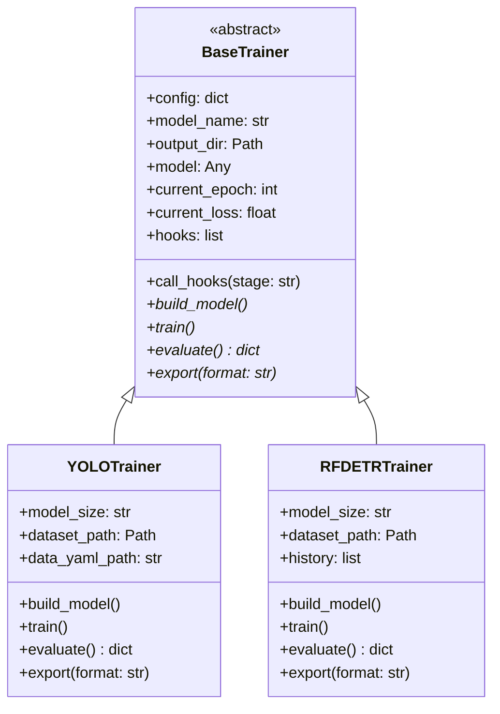

# The BaseTrainer Contract

`BaseTrainer` is the abstract foundation that **every** training engine in IsiDetector must inherit from. It defines the universal interface, manages output directories, and drives the hook lifecycle.

---

## Why an Abstract Base?

The `BaseTrainer` solves a critical problem: **the orchestration layer (`run_train.py`) needs to call `.train()`, `.evaluate()`, and `.export()` without knowing or caring which model is underneath**.



---

## Annotated Source

:material-file-code: **Source**: `src/training/base_trainer.py`

### Constructor

```python
class BaseTrainer(ABC):
    def __init__(self, config: dict):
        self.config = config
        self.model_name = config.get('model_type', 'unknown_model')  # (1)!

        # 1. Setup Output Directories
        self.output_dir = Path(config.get('output_dir', 'models')) / self.model_name  # (2)!
        self.output_dir.mkdir(parents=True, exist_ok=True)

        # 2. Universal State Variables
        self.model = None          # (3)!
        self.current_epoch = 0
        self.current_loss = 0.0

        # 3. Initialize Hooks from config
        self.hooks = []
        hook_names = config.get('hooks', [])  # (4)!
        for h_name in hook_names:
            try:
                hook_class = HOOKS.get(h_name)
                self.hooks.append(hook_class())
            except KeyError:
                logger.error(f"❌ Hook '{h_name}' not found in Registry.")
```

1. Reads `model_type` from config to use as a folder name (e.g., `"yolo"` or `"rfdetr"`)
2. Default output root is `models/`. Creates `models/yolo/` or `models/rfdetr/` automatically
3. These state variables are **updated by concrete trainers** during training. Hooks read them to display metrics
4. Reads the `hooks:` list from YAML, looks each one up in the `HOOKS` registry, and instantiates it

---

### Hook Lifecycle

```python
def call_hooks(self, stage: str):
    """
    Broadcasts the current stage to all registered hooks.
    Stages: 'before_train', 'before_epoch', 'after_epoch', 'after_train'
    """
    for hook in self.hooks:
        if hasattr(hook, stage):           # (1)!
            hook_method = getattr(hook, stage)
            hook_method(self)              # (2)!
```

1. Checks if the hook implements this particular stage. Hooks are free to only implement the stages they care about
2. Passes `self` (the trainer instance) to the hook, so hooks can read `trainer.current_epoch`, `trainer.current_loss`, `trainer.config`, etc.

!!! info "Broadcasting Pattern"
    This is a lightweight Observer pattern. Concrete trainers call `self.call_hooks('after_epoch')` at the right moment, and all hooks that support that stage get notified.

---

### The Four Abstract Methods

```python
@abstractmethod
def build_model(self):
    """Initializes the architecture and loads it to the GPU."""
    pass

@abstractmethod
def train(self):
    """The main training loop. MUST call self.call_hooks() at appropriate stages."""
    pass

@abstractmethod
def evaluate(self) -> dict:
    """Runs validation and returns a dictionary of metrics (mAP, etc)."""
    pass

@abstractmethod
def export(self, format: str = 'onnx'):
    """Exports the trained weights to the deployment format."""
    pass
```

| Method | Must Return | Used By |
|---|---|---|
| `build_model()` | Nothing | Called internally by `train()` if `self.model` is None |
| `train()` | Nothing | Runs the full training loop with hook calls |
| `evaluate()` | `dict` of metrics | Post-training validation: mAP, speed, etc. |
| `export()` | Export file path | Converts weights to ONNX/OpenVINO for deployment |

!!! warning "Contract Rule"
    Every concrete trainer **must** call `self.call_hooks('before_train')` and `self.call_hooks('after_train')` inside its `train()` method. If it doesn't, hooks won't fire. The base class doesn't enforce this at runtime — it's a convention.

---

## State Variables That Hooks Read

The base trainer maintains shared state that hooks (and other consumers) can inspect:

```python
trainer.config          # The full merged config dictionary
trainer.model_name      # "yolo" or "rfdetr"
trainer.output_dir      # Path where weights and logs are saved
trainer.model           # The underlying model object
trainer.current_epoch   # Updated each epoch by the concrete trainer
trainer.current_loss    # Updated each epoch by the concrete trainer
```

This is the **communication contract** between trainers and hooks — trainers write to these fields, hooks read from them.

---

## How Concrete Trainers Use It

=== "YOLOTrainer"

    ```python
    class YOLOTrainer(BaseTrainer):
        def train(self):
            self.build_model()
            self._inject_hooks()       # Bridge Ultralytics → BaseTrainer hooks
            self.call_hooks('before_train')
            self.model.train(...)      # Ultralytics does the heavy lifting
            self.call_hooks('after_train')
    ```

=== "RFDETRTrainer"

    ```python
    class RFDETRTrainer(BaseTrainer):
        def train(self):
            self.build_model()
            self.call_hooks('before_train')
            self.model.train(...)      # Roboflow does the heavy lifting
            self.call_hooks('after_train')
            self._plot_loss_curves()
    ```

Both follow the same pattern: **build → hook(before) → native train → hook(after)**, but their internals are completely different.
