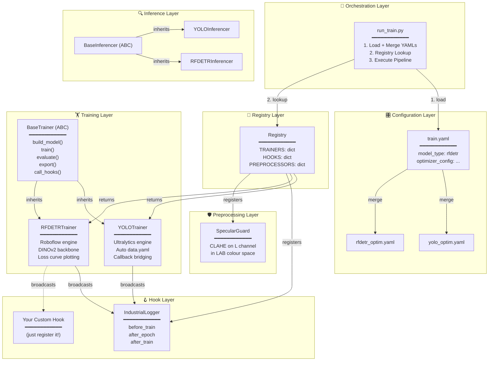
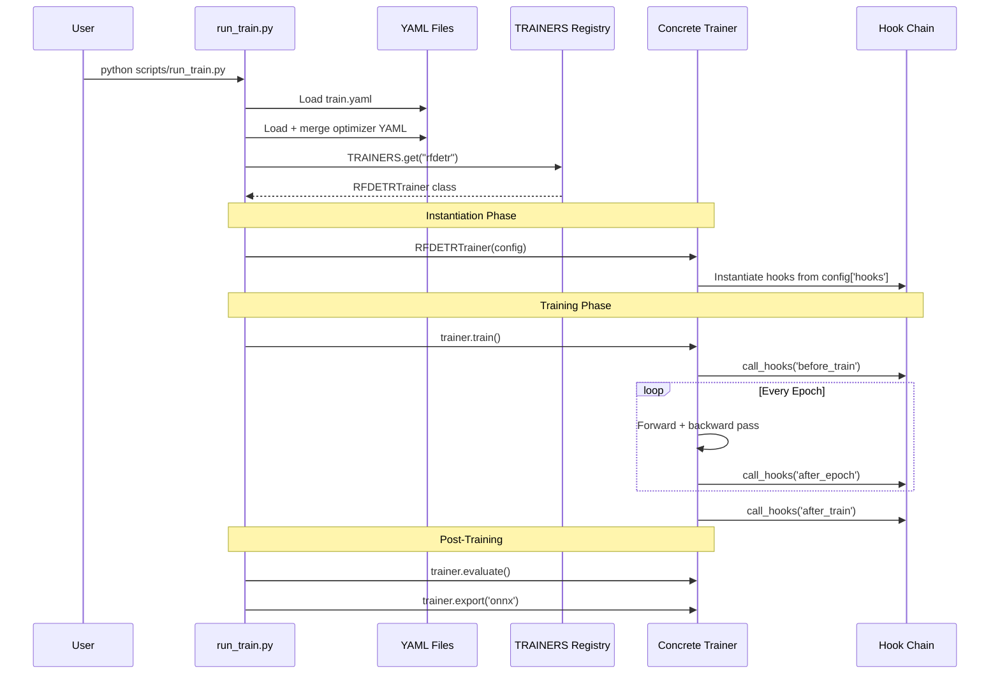

# System Architecture

This page explains the overall design philosophy and how all the components fit together.

---

## Design Philosophy

IsiDetector follows three core principles:

1. **Config-Driven** — Every tuneable parameter lives in YAML, never hardcoded
2. **Registry Pattern** — Classes register themselves; the entrypoint discovers them at runtime
3. **Strategy Pattern** — One abstract contract, multiple interchangeable implementations

These patterns combine to create a system where **adding a new model architecture requires zero changes to existing code** — you just write a new trainer class and register it.

---

## Full Architecture Diagram

---

## The Five Layers

### 1. Configuration Layer

Everything starts in YAML. The master config (`train.yaml`) holds global settings and points to model-specific optimizer configs that get **merged** at runtime.

!!! info "Config Merging"
    The `optimizer_config` field in `train.yaml` points to a secondary YAML file. At startup, `run_train.py` reads both files and calls `config.update(optim_config)`, producing a single flat dictionary that gets passed to the trainer.

[:material-arrow-right: Full Configuration Guide](../config/index.md)

---

### 2. Orchestration Layer

`run_train.py` is the CLI entrypoint that:

1. Parses `--config` and `--resume` arguments
2. Loads and merges YAMLs into one config dict
3. Reads `model_type` from config
4. Calls `TRAINERS.get(model_type)` to get the right class
5. Instantiates and runs the full pipeline: **train → evaluate → export**

It has **no awareness** of what model it's running. It just trusts the registry.

---

### 3. Registry Layer

Three singleton registries act as name → class lookup tables. Classes register themselves with decorators at import time. The entrypoint triggers the imports, then looks up the right class by string name.

[:material-arrow-right: Registry Deep-Dive](registry.md)

---

### 4. Training Layer

The `BaseTrainer` abstract class defines the universal contract. Every trainer must implement four methods: `build_model()`, `train()`, `evaluate()`, and `export()`. The base also handles hook lifecycle management.

[:material-arrow-right: BaseTrainer Deep-Dive](base-trainer.md)

---

### 5. Support Layers

**Hooks** listen to training lifecycle events. **Inferencers** run prediction. **Preprocessors** transform images before they enter the pipeline.

[:material-arrow-right: Hooks](../hooks/index.md) · [:material-arrow-right: Inference](../inference/index.md) · [:material-arrow-right: Preprocessing](../preprocessing/index.md)

---

## Data Flow

Here's exactly what happens when you run `python scripts/run_train.py`:

