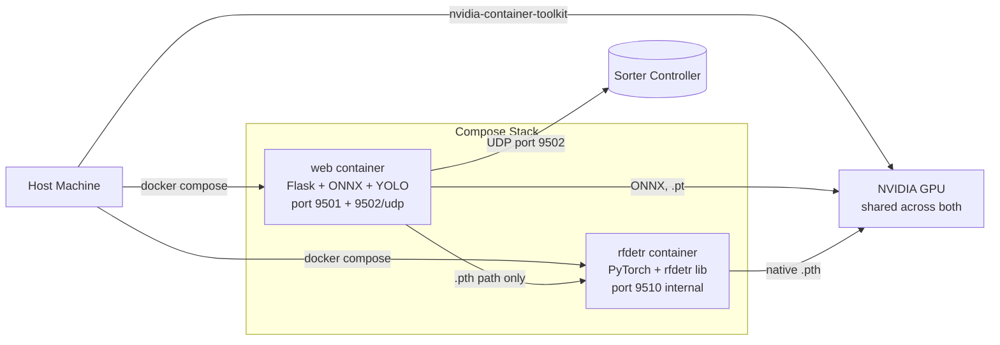

# Deployment — Docker, Scripts, and Site Bring-Up

IsiDetector ships as a two-container Docker stack. This page walks through everything from unboxing on a fresh host to daily operation on a production line.

---

## The Two Scripts

Two shell scripts at the repo root drive the whole deployment lifecycle:

| Script | Role | When to run |
|---|---|---|
| [`run_start.sh`](#run_startsh-one-time-host-bootstrap) | One-time host bootstrap — installs Docker, NVIDIA toolkit, builds images, writes `.deployment.env` | **First time only**, on a fresh machine |
| [`up.sh`](#upsh-daily-starter) | Daily starter — picks the compose profile, brings the stack up, opens Chrome when ready | **Every day**, or after a `docker compose down` |

Everything else (`docker-compose.yml`, `Dockerfile`, `src/`, `isitec_app/`, weights) is configuration and payload. The two scripts orchestrate them.

---

## Architecture at a Glance



- **`web` container** — Flask app, ONNX Runtime for `.onnx` weights, Ultralytics for `.pt` weights, sends UDP triggers to the sorter.
- **`rfdetr` sidecar** — Isolated Python environment for RF-DETR's `.pth` path (its `transformers` pin conflicts with Ultralytics, so we split). Only used when operators load a `.pth` file.
- **Shared GPU** — both containers pass through the host's NVIDIA GPU via `nvidia-container-toolkit`.

---

## What to Pack for a Site Delivery

The minimum folder you deliver to the customer:

```text
isidetector-delivery/
├── run_start.sh                    # Host bootstrap
├── up.sh                           # Daily starter
├── scripts/up.sh                   # Same as root up.sh (shorter paths from scripts/)
├── docker-compose.yml              # GPU compose manifest
├── docker-compose.cpu.yml          # CPU override (stripped GPU reservations)
├── Dockerfile                      # web container
├── Dockerfile.rfdetr               # rfdetr sidecar container
├── requirements-deploy.txt         # web container's Python deps
├── src/                            # Shared inference + utility code
├── isitec_app/                     # Flask app (templates, static, settings.json)
├── configs/
│   └── train.yaml                  # class_names, imgsz, UDP defaults, hook list
├── models/
│   ├── yolo/<run_id>/weights/best.onnx    # YOLO ONNX weight (at minimum)
│   └── rfdetr/<run_id>/inference_model.onnx  # RF-DETR ONNX weight (optional)
└── isitec_api/                     # Optional — FastAPI backend
```

Exclude these (runtime artefacts, caches, training data):

```text
data/                    # Training datasets (huge)
runs/                    # Training run outputs
isitec_app/logs/         # Hourly CSV analytics (fills at runtime)
isitec_app/uploads/      # Operator-uploaded videos (fills at runtime)
.deployment.env          # Per-host flag (regenerated by run_start.sh)
**/__pycache__/
*.pyc
```

Everything in `.gitignore` is a safe exclude. If you ship a `git archive --format=tar.gz HEAD`, that list is honoured automatically.

---

## Host Prerequisites

The host machine needs:

1. **Linux** — Ubuntu 22.04 or 24.04 tested. Debian derivatives should work. macOS and Windows via Docker Desktop are unsupported for the GPU path.
2. **(Optional) NVIDIA GPU** with driver ≥ 550 supporting CUDA 12.8. Without a GPU the stack runs on CPU via OpenVINO (~3–5× slower).
3. **Internet access on first run** to pull base CUDA images, install Docker, and download Python dependencies. After the first build, the stack runs offline.
4. **sudo privileges** for the first run — `run_start.sh` installs system packages.

No Python, no PyTorch, no CUDA libs needed on the host. Everything lives inside containers.

---

## `run_start.sh` — One-Time Host Bootstrap

:material-file-code: **Source**: `run_start.sh`

Run once per machine. The script walks seven stages:

| Stage | What it does |
|---|---|
| **1. Platform detection** | WSL2 vs native Linux, X11 availability, GPU presence |
| **2. Docker Engine** | Installs via official apt repo if not present |
| **3. Docker service + permissions** | Starts the daemon, adds `$USER` to `docker` group |
| **4. NVIDIA Container Toolkit** | Installs and configures if GPU detected; skipped on CPU-only hosts |
| **5. Runtime verification** | Runs `docker run --gpus all nvidia/cuda:...` to confirm GPU-in-Docker works |
| **6. Build images** | `docker compose build` — pulls base images, installs Python deps, copies code. **First build: 5–15 min.** |
| **7. GUI check** | Reports whether `cv2.imshow()` will work (for `run_live.py` CLI usage) |

Final step: writes `.deployment.env` to record whether this host is GPU or CPU, and whether `sudo` is needed for Docker commands. `up.sh` reads this file.

Invocation:

```bash
chmod +x run_start.sh    # first time only
./run_start.sh
```

Expected output on a GPU host:

```
▶ Stage 1/7 — Hardware & Platform Detection
[  OK]  Platform: Native Linux
[  OK]  NVIDIA GPU detected: NVIDIA GeForce RTX 4090
...
▶ Stage 6/7 — Build & Launch IsiDetector
[INFO]  Building Docker image (first build takes 5-10 minutes)...
[  OK]  Docker image ready
...
[  OK]  Deployment profile saved to .deployment.env

  Next step:
    ./up.sh          — start containers and open the UI

  Bootstrap complete. Run ./up.sh to start the platform.
```

If the script aborts, fix the failing stage and re-run — it's idempotent (skips stages that already completed).

!!! tip "Idempotency"
    You can re-run `run_start.sh` any time. Already-installed packages are skipped, images are rebuilt with Docker's layer cache so only changed layers run again (usually ~30s instead of 10min).

---

## `up.sh` — Daily Starter

:material-file-code: **Source**: `up.sh` (root) and `scripts/up.sh` (same content, longer path)

Runs every time you want to start the stack. The flow:

1. **Pick the compose profile** — reads `.deployment.env` for `COMPOSE_MODE=gpu|cpu`. Fallback: autodetect via `nvidia-smi`.
2. **Build and start containers** — `docker compose up -d --build`. Subsequent runs hit the layer cache and finish in ~5 s.
3. **Wait for readiness** — tails the `web` container log for the line:
   ```
   🔥 ONNX preload (CUDA kernels warm, session discarded): /opt/isitec/...
   ```
   This fires after the rfdetr sidecar reports healthy AND the web container warms the default RF-DETR ONNX CUDA kernels. At that point the system is ready for a first operator click.
4. **Open Chrome to `http://localhost:9501`** — preferring Chrome, falling back to system default.

Browser selection order:

| Position | Launcher | Platforms |
|---|---|---|
| 1 | `google-chrome`, `google-chrome-stable`, `chromium`, `chromium-browser` | Linux |
| 2 | `open -a "Google Chrome"` → `open` | macOS |
| 3 | `wslview` → `cmd.exe /c start chrome` → `cmd.exe /c start ""` | WSL |
| 4 | `xdg-open` | Generic Linux |

Override knobs:

```bash
URL=http://192.168.1.50:9501 ./up.sh   # open a remote host instead
TIMEOUT_SEC=60                ./up.sh   # tighter readiness wait (default 300)
NO_BROWSER=1                  ./up.sh   # start the stack, skip browser launch (headless)
FORCE_CPU=1                   ./up.sh   # force CPU compose on a GPU host (testing)
```

---

## Daily Operations

```bash
# Start (after a reboot, or first time)
./up.sh

# Restart after a code or config change
docker compose down && ./up.sh

# Stop without removing containers (faster restart later)
docker compose stop
# ...later, same day:
docker compose start

# Tail logs (live)
docker compose logs -f                 # both containers
docker compose logs -f web             # web only
docker compose logs -f rfdetr          # rfdetr sidecar only
docker compose logs --tail=200 web     # last 200 lines, no follow

# Shell into a running container for debugging
docker compose exec web bash
docker compose exec rfdetr bash

# Inspect GPU usage
docker compose exec web nvidia-smi
```

Ctrl+C while tailing logs only stops the `logs` command — **containers keep running in the background**.

---

## Deployment Modes: GPU vs CPU

`docker-compose.cpu.yml` is a merge layer that strips the `deploy.resources.reservations.devices` GPU block from both services, so the same image runs on a CPU-only host.

When `run_start.sh` detects no GPU, it writes `COMPOSE_MODE=cpu` into `.deployment.env`, and `up.sh` runs:

```bash
docker compose -f docker-compose.yml -f docker-compose.cpu.yml up -d --build
```

On a CPU-only host, plan for:

- Use **OpenVINO (`.xml`)** weights for best throughput on Intel CPUs (~2× faster than ONNX-CPU).
- RF-DETR (`.pth`) inference is effectively unusable on CPU for real-time work — stick to YOLO.
- Expect 10–20 FPS at 416 px input with YOLOv26-n, depending on CPU cores.

---

## Timezone

Both images set `TZ=Europe/Paris` and bundle `tzdata`. Timestamps in CSV logs, UDP payloads (`"ts"` field), and the UI footer all match the host's wall clock for a rig operating in France.

For deployments outside France, change `Europe/Paris` in three places:

- `Dockerfile` (around `ENV TZ=...`)
- `Dockerfile.rfdetr` (same pattern)
- `docker-compose.yml` → `services.web.environment` and `services.rfdetr.environment`

Or externalise with `TZ=${TZ:-Europe/Paris}` in `docker-compose.yml` and set the variable per-host in a `.env` file.

---

## ONNX Preload — Why the Boot Takes 30 Seconds

When `up.sh` starts the stack, these happen in sequence:

```
t=0s     docker compose up -d
         rfdetr container starts, begins importing rfdetr+transformers (~25s)
t=25s    rfdetr healthcheck returns 200 → "healthy"
t=26s    web container starts (depends_on: condition: service_healthy)
t=28s    Flask app boots on port 9501
t=28s    Background thread kicks off preload_onnx() on the default RF-DETR ONNX
t=33s    cuDNN kernel autotuning completes — `🔥 ONNX preload (CUDA kernels warm...)` logs
t=33s    ✓ Web container ready — up.sh opens Chrome
```

The preload discards the session but keeps cuDNN's compiled kernels in the driver cache for the process lifetime — so the first **actual** hot-swap to that RF-DETR ONNX weight (when an operator clicks Start) takes ~2 s instead of 5–8 s. See [ONNX Engine — CUDA Kernel Preload](inference/onnx.md#5-cuda-kernel-preload-at-app-startup) for the deeper story on why this workaround exists (cross-thread session sharing in ONNX Runtime's CUDA EP stalls for many seconds).

---

## Volume Mounts — What Persists Across Container Restarts

`docker-compose.yml` bind-mounts these host directories into the `web` container:

| Host path | Container path | Purpose |
|---|---|---|
| `./models` | `/opt/isitec/models` | Weight files |
| `./runs` | `/opt/isitec/runs` | Training run artefacts (read-only in deployment) |
| `./configs` | `/opt/isitec/configs` | `train.yaml` + optimizer YAMLs |
| `./isitec_app/logs` | `/opt/isitec/isitec_app/logs` | Hourly analytics CSVs |
| `./isitec_app/uploads` | `/opt/isitec/isitec_app/uploads` | Operator-uploaded videos |
| `./isitec_app/settings.json` | same | Default weight paths, thresholds, line config, belt direction |
| `./site` | `/opt/isitec/isitec_app/static/docs` (read-only) | Built MkDocs documentation served at `/docs` |

So adding a new `.onnx` weight is as simple as dropping it into `models/yolo/<run>/weights/` on the host — no container rebuild, no restart.

`isitec_app/settings.json` holds **per-site** configuration. Set it once after first boot:

```json
{
  "yolo_weights": "models/yolo/<your-run>/weights/best.onnx",
  "rfdetr_weights": "models/rfdetr/<your-run>/inference_model.onnx",
  "yolo_imgsz": 416,
  "yolo_conf": 0.5,
  "detr_imgsz": 416,
  "detr_conf": 0.35,
  "line_orientation": "vertical",
  "line_position": 0.5,
  "belt_direction": "left_to_right"
}
```

---

## Troubleshooting

### `docker compose up` hangs for 30+ seconds at startup
Normal on first boot — the `web` service waits for the `rfdetr` sidecar's healthcheck (`depends_on: condition: service_healthy`). The rfdetr Python deps take ~25 s to import the first time. Subsequent boots on the same host are faster because layers are cached.

### UI opens but the video feed is blank
Check `/api/stats` — if `is_running: false`, no stream has been started. Go to Live Inference, pick a source (file or RTSP), click Start.

If `is_running: true` but video is still black, tail the web log:
```bash
docker compose logs -f web | grep -iE "error|fail|onnx"
```
Most common cause: the selected weight file doesn't exist. `settings.json` may point to a run that was never copied over.

### GPU not visible inside Docker
```bash
docker run --rm --gpus all nvidia/cuda:12.8.0-base-ubuntu22.04 nvidia-smi
```
If this fails, `nvidia-container-toolkit` isn't properly configured. Re-run `./run_start.sh` or manually:
```bash
sudo apt install nvidia-container-toolkit
sudo nvidia-ctk runtime configure --runtime=docker
sudo systemctl restart docker
```

### Stale image after a code change
```bash
docker compose down && ./up.sh
```
The `--build` flag in `up.sh` rebuilds only changed layers. If you want to force a full rebuild:
```bash
docker compose build --no-cache && ./up.sh
```

### VRAM creeping up over many hot-swaps
The web container holds cuDNN kernel caches and the current model's GPU allocation. A few swaps of a ~500 MB model can accumulate up to 2–3 GB. If you hit VRAM limits, `docker compose restart web` drops everything and rebuilds from the preloaded defaults in ~30 s.

### WSL2: browser opens on Windows but can't reach the service
On WSL2, `localhost:9501` is auto-forwarded by Windows most of the time. If not:
```bash
URL=http://$(hostname -I | awk '{print $1}'):9501 ./up.sh
```
This opens the browser against the WSL2 VM's internal IP directly.

---

## Summary — The One-Liner Cheat Sheet

```bash
# First time on a fresh machine:
./run_start.sh && ./up.sh

# Every day:
./up.sh

# Restart after any change:
docker compose down && ./up.sh

# Monitor:
docker compose logs -f web

# Stop everything:
docker compose down
```
