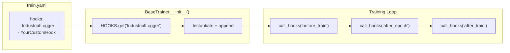

# Hook System

The hook system provides a lightweight **Observer pattern** for reacting to training lifecycle events without modifying trainer code. Hooks are registered by name and attached via YAML config.

---

## How Hooks Work



### Lifecycle Stages

| Stage | When It Fires | Common Use |
|---|---|---|
| `before_train` | Before first epoch | Print headers, start timers, init connections |
| `before_epoch` | Before each epoch | Reset per-epoch counters |
| `after_epoch` | After each epoch | Log metrics, save checkpoints, send alerts |
| `after_train` | After final epoch | Print summary, close connections, cleanup |

### What Hooks Receive

Every hook method receives the **trainer instance** as its argument:

```python
def after_epoch(self, trainer):
    trainer.current_epoch    # Current epoch number
    trainer.current_loss     # Current training loss
    trainer.config           # Full merged config dict
    trainer.output_dir       # Path to output directory
    trainer.model_name       # "yolo" or "rfdetr"
```

---

## IndustrialLogger — The Built-In Hook

:material-file-code: **Source**: `src/training/hooks/industrial_logger.py`
:material-tag: **Registry Name**: `"IndustrialLogger"`

A formatted, table-style epoch logger designed for industrial CV workflows:

```python
@HOOKS.register('IndustrialLogger')
class IndustrialLogger:
    """A clean, epoch-level logger for Industrial Computer Vision."""

    def before_train(self, trainer):                        # (1)!
        header = (
            f"\n{'Epoch':>8} {'GPU_mem':>10} {'box_loss':>10} "
            f"{'seg_loss':>10} {'cls_loss':>10} {'dfl_loss':>10} "
            f"{'Instances':>10} {'Size':>8}"
        )
        print(header)
        print("-" * len(header))

    def after_epoch(self, trainer):                         # (2)!
        epoch_str = f"{trainer.current_epoch + 1}/{trainer.config.get('epochs', 30)}"
        gpu_mem = f"{torch.cuda.memory_reserved(0) / 1e9:.2f}G"

        row = (
            f"{epoch_str:>8} {gpu_mem:>10} "
            f"{trainer.current_loss:>10.4f} {'--':>10} "
            f"{'--':>10} {'--':>10} {'--':>10} "
            f"{trainer.config.get('image_size', 640):>8}"
        )
        print(row)

    def after_train(self, trainer):                         # (3)!
        print("-" * 80)
        logger.info(f"✅ Training Complete. Weights at {trainer.output_dir}")
```

1. Prints a formatted table header at the start of training
2. Prints one row per epoch with epoch progress, GPU memory, and loss
3. Prints a completion message with the output directory

**Sample output:**

```text
   Epoch    GPU_mem   box_loss   seg_loss   cls_loss   dfl_loss  Instances     Size
---------------------------------------------------------------------------------------
   1/200      4.23G     1.2345         --         --         --         --      640
   2/200      4.23G     1.1892         --         --         --         --      640
   3/200      4.24G     1.0456         --         --         --         --      640
```

---

## Creating a Custom Hook

Adding a new hook requires **three steps**:

### Step 1: Write the Hook Class

```python title="src/training/hooks/slack_alert.py"
import logging
from src.shared.registry import HOOKS

logger = logging.getLogger(__name__)

@HOOKS.register('SlackAlert')
class SlackAlert:
    """Sends a Slack message when training finishes."""

    def __init__(self):
        self.webhook_url = "https://hooks.slack.com/services/YOUR/WEBHOOK"

    def after_train(self, trainer):
        import requests
        message = (
            f"🏁 Training Complete!\n"
            f"Model: {trainer.model_name}\n"
            f"Final Loss: {trainer.current_loss:.4f}\n"
            f"Weights: {trainer.output_dir}"
        )
        requests.post(self.webhook_url, json={"text": message})
        logger.info("📨 Slack notification sent!")
```

### Step 2: Import It

```python title="scripts/run_train.py"
import src.training.hooks.slack_alert  # Add this line
```

### Step 3: Enable It in Config

```yaml title="configs/train.yaml"
hooks:
  - "IndustrialLogger"
  - "SlackAlert"            # Add this line
```

That's it. The hook system handles the rest.

!!! tip "Hooks Are Optional Per-Stage"
    A hook doesn't need to implement every stage. If `SlackAlert` only has `after_train`, it's simply skipped during `before_train` and `after_epoch` broadcasts.
