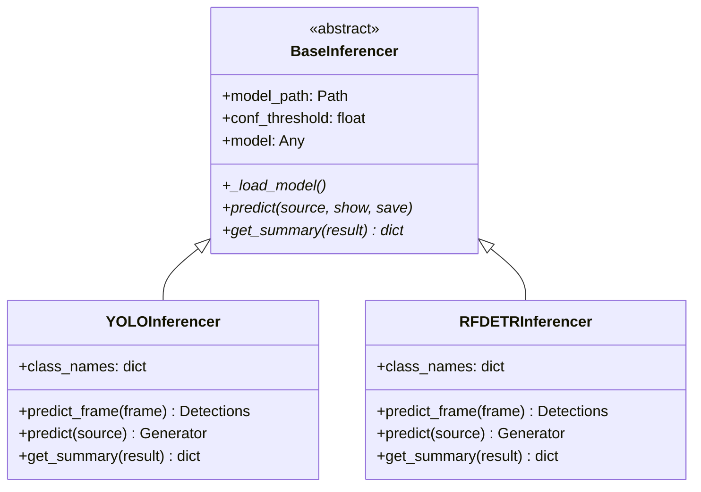

# Inference Engines

The inference layer mirrors the training layer's design — an abstract `BaseInferencer` defines the contract, and concrete implementations handle YOLO and RF-DETR specifics.

---

## Architecture



---

## BaseInferencer

:material-file-code: **Source**: `src/inference/base_inferencer.py`

```python
class BaseInferencer(ABC):
    def __init__(self, model_path: str, conf_threshold: float = 0.5):
        self.model_path = Path(model_path)
        self.conf_threshold = conf_threshold

        if not self.model_path.exists():
            raise FileNotFoundError(f"❌ Weights not found at {self.model_path}")

        self.model = self._load_model()
```

| Abstract Method | Returns | Purpose |
|---|---|---|
| `_load_model()` | Model object | Load weights into RAM/VRAM |
| `predict(source)` | Generator of dicts | Run inference (yields results one by one) |
| `get_summary(result)` | `dict` | Translate raw output into simple metrics |

---

## YOLOInferencer

:material-file-code: **Source**: `src/inference/yolo_inferencer.py`

### Frame-Level Prediction

The `predict_frame()` method handles single video frames with intelligent 640px scaling:

```python
def predict_frame(self, frame: np.ndarray):
    orig_h, orig_w = frame.shape[:2]

    # Only downsize if larger than 640px
    if max(orig_h, orig_w) > 640:
        scale = 640 / max(orig_h, orig_w)
        new_w, new_h = int(orig_w * scale), int(orig_h * scale)
        input_frame = cv2.resize(frame, (new_w, new_h))        # (1)!
    else:
        input_frame = frame
        scale = 1.0

    # Run inference at 640px
    results = self.model(input_frame, conf=self.conf_threshold,
                         imgsz=640, verbose=False)[0]
    detections = sv.Detections.from_ultralytics(results)        # (2)!

    # Scale detections back to original resolution
    if needs_scaling and len(detections) > 0:
        inv_scale = 1 / scale
        detections.xyxy *= inv_scale                            # (3)!

        if detections.mask is not None:
            resized_masks = []
            for mask in detections.mask:
                m = cv2.resize(mask.astype("uint8"),
                             (orig_w, orig_h),
                             interpolation=cv2.INTER_NEAREST)   # (4)!
                resized_masks.append(m.astype(bool))
            detections.mask = np.array(resized_masks)

    return detections
```

1. Downscale for faster inference while maintaining aspect ratio
2. Convert from Ultralytics' custom format to `supervision.Detections` — a standardised format
3. Scale bounding boxes back to the original image resolution
4. Segmentation masks are resized with **nearest-neighbour** interpolation to avoid blurry mask edges

### Stream-Level Prediction

```python
def predict(self, source: str, show=False, save=False):
    source_val = int(source) if str(source).isdigit() else source  # (1)!
    results_gen = self.model.predict(
        source=source_val, conf=self.conf_threshold,
        stream=True, verbose=False
    )
    for r in results_gen:
        detections = sv.Detections.from_ultralytics(r)
        yield {"path": r.path, "detections": detections, "raw": r}
```

1. If source is `"0"`, converts to `int(0)` for webcam access. Otherwise treats as file path / URL.

---

## RFDETRInferencer

:material-file-code: **Source**: `src/inference/rfdetr_inferencer.py`

### Key Differences from YOLO

| Aspect | YOLO | RF-DETR |
|---|---|---|
| Input format | NumPy array (BGR) | PIL Image (RGB) |
| Model loading | `YOLO(path)` | `RFDETRSegMedium(pretrain_weights=path)` |
| Optimization | N/A | `model.optimize_for_inference()` |
| Prediction API | `model(frame)` | `model.predict(image, threshold=...)` |

```python
def _load_model(self):
    model = RFDETRSegMedium(pretrain_weights=str(self.model_path))
    model.optimize_for_inference()                          # (1)!
    return model
```

1. RF-DETR-specific optimization that fuses layers and applies TorchScript tracing for faster inference

### Built-In Visualisation

The RF-DETR inferencer includes a full visualisation pipeline using `supervision`:

```python
def _visualize(self, path, detections, show, save):
    cv_image = cv2.imread(str(path))

    # Three-layer annotation: masks → boxes → labels
    annotated = sv.MaskAnnotator().annotate(scene=cv_image,
                                            detections=detections)
    annotated = sv.BoxAnnotator().annotate(scene=annotated,
                                           detections=detections)
    labels = [f"{self.class_names.get(c_id, 'obj')} {conf:.2f}"
              for c_id, conf in zip(detections.class_id,
                                     detections.confidence)]
    annotated = sv.LabelAnnotator().annotate(scene=annotated,
                                             detections=detections,
                                             labels=labels)
```

---

## Using the Inferencers

=== "YOLO — Single Image"

    ```python
    from src.inference.yolo_inferencer import YOLOInferencer

    engine = YOLOInferencer("models/yolo/best.pt", conf_threshold=0.5)
    for result in engine.predict("data/test1.jpg"):
        print(engine.get_summary(result))
    ```

=== "YOLO — Live Camera"

    ```python
    engine = YOLOInferencer("models/yolo/best.pt")
    cap = cv2.VideoCapture(0)
    while True:
        ret, frame = cap.read()
        detections = engine.predict_frame(frame)
        # Draw and display...
    ```

=== "RF-DETR — Single Image"

    ```python
    from src.inference.rfdetr_inferencer import RFDETRInferencer

    engine = RFDETRInferencer("models/rfdetr/best.pt", conf_threshold=0.5)
    for result in engine.predict("data/test1.jpg", show=True):
        print(engine.get_summary(result))
    ```
