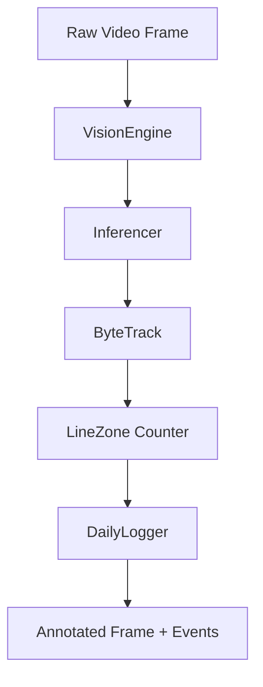

# Unified Vision Engine

The `VisionEngine` is the "brain" of the IsiDetector platform. It unifies the detection logic so that your Command Line scripts and your Web Application behave identically.

---

## Architecture

:material-file-code: **Source**: `src/shared/vision_engine.py`

The engine encapsulates the entire computer vision pipeline into a single, stateful class:



### Key Functionalities

#### 1. Tracking Continuity
By wrapping the `sv.ByteTrack` module, the engine assigns persistent IDs to every parcel (e.g., `#104`). This ensures that even if a parcel is briefly obscured, the system remembers it until it crosses the counting line.

#### 2. Trigger Management
The `process_frame()` method handles the precise logic of "Line Crossing". 
- It detects when an object's **Bottom Center** point crosses the designated vertical line.
- It ensures an object is **only counted once** per session, even if it hovers over the line.

#### 3. Real-Time Visualization
The engine generates a fully annotated frame including:
- **Segmentation Masks**: Transparent color overlays on the parcels.
- **Tracing**: Visual lines showing the path the parcel has taken.
- **Labels**: High-contrast text overlays with Object IDs and Class Names.

---

## Implementation Example

```python
from src.shared.vision_engine import VisionEngine
from src.inference.onnx_inferencer import ONNXInferencer

# 1. Initialize
engine = VisionEngine(
    inferencer=ONNXInferencer("best.onnx"),
    config=my_config_dict
)

# 2. Process
annotated, detections, event = engine.process_frame(frame, counts)

# 3. Handle Events
if event:
    print(f"Parcel {event['id']} ({event['class']}) crossed the line!")
```
