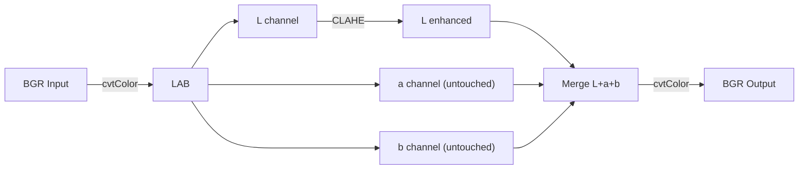

# Preprocessing — SpecularGuard

The `SpecularGuard` preprocessor solves a common industrial imaging problem: **polybag glare and deep conveyor shadows** that confuse segmentation models.

:material-file-code: **Source**: `src/preprocess/clahe_engine.py`
:material-tag: **Registry Name**: `"specular-guard"`

---

## The Problem

In warehouse environments, two lighting issues dominate:

1. **Specular reflections** on polybags — shiny plastic creates white hotspots that wash out texture
2. **Deep shadows** under stacked cartons — dark regions lose detail and get missed by detectors

Standard approaches like histogram equalisation affect the **entire image** including colour channels, which distorts the actual parcel appearance. This leads to false positives and poor segmentation boundaries.

---

## The Solution: CLAHE in LAB Colour Space

SpecularGuard uses **Contrast Limited Adaptive Histogram Equalisation (CLAHE)** applied only to the **Lightness channel** of the **LAB colour space**.

### Why LAB?

| Colour Space | Problem |
|---|---|
| **RGB** | Channels are correlated. Equalising one changes the perceived colour |
| **HSV** | V (Value) affects saturation perception. Equalising V shifts colours |
| **LAB** | L (Lightness) is completely independent of colour (a, b). Equalising L only changes brightness, not colour |



---

## How CLAHE Works

Standard histogram equalisation spreads pixel intensities across the full range (0–255). But it has two problems:

1. It's **global** — doesn't handle local variations well
2. It can **over-amplify noise** in dark regions

**CLAHE** fixes both:

- **Adaptive**: Divides the image into tiles (e.g., 8×8) and equalises each tile independently, handling both bright and dark regions
- **Contrast Limited**: Clips the histogram at a threshold (`clipLimit`) before equalising, preventing noise amplification

---

## Annotated Source

```python
@PREPROCESSORS.register('specular-guard')
class SpecularGuard:
    """
    Enhances image lightness in LAB colour space to preserve
    actual parcel colours while lifting shadows and stabilising glare.
    """
    def __init__(self, clip_limit: float = 2.5,
                 tile_grid: list = [8, 8]):
        grid_tuple = tuple(tile_grid)
        self.clahe = cv2.createCLAHE(
            clipLimit=clip_limit,       # (1)!
            tileGridSize=grid_tuple     # (2)!
        )
```

1. **`clipLimit=2.5`**: Controls how much contrast enhancement is allowed. Higher = more enhancement but more noise. 2.5 is a balanced default for warehouse lighting
2. **`tileGridSize=(8, 8)`**: Divides the image into an 8×8 grid of tiles. Each tile gets independent equalisation. Smaller tiles = more local adaptation but slower

```python
    def process(self, image: np.ndarray) -> np.ndarray:
        if image is None:
            raise ValueError("Received empty image array.")

        # 1. Convert to LAB
        lab = cv2.cvtColor(image, cv2.COLOR_BGR2LAB)
        l, a, b = cv2.split(lab)

        # 2. Apply CLAHE to L channel ONLY
        l_enhanced = self.clahe.apply(l)        # (1)!

        # 3. Reconstruct and return
        enhanced_lab = cv2.merge((l_enhanced, a, b))
        return cv2.cvtColor(enhanced_lab, cv2.COLOR_LAB2BGR)
```

1. This is the key line — CLAHE is applied **only to the L (Lightness) channel**. The `a` (green–red) and `b` (blue–yellow) channels remain untouched, preserving the original parcel colours.

---

## Effect Comparison

| | Shadows | Glare | Colours |
|---|---|---|---|
| **No preprocessing** | Lost detail | Washed out | Accurate |
| **Global histogram eq** | Lifted | Reduced | Distorted ❌ |
| **CLAHE on RGB** | Lifted | Reduced | Shifted ❌ |
| **CLAHE on LAB (SpecularGuard)** | Lifted ✅ | Stabilised ✅ | Preserved ✅ |

---

## Usage

```python
from src.preprocess.clahe_engine import SpecularGuard
import cv2

# Initialise
guard = SpecularGuard(clip_limit=2.5, tile_grid=[8, 8])

# Process a single image
image = cv2.imread("data/test1.jpg")
enhanced = guard.process(image)

# Save result
cv2.imwrite("output/enhanced.jpg", enhanced)
```

!!! tip "Tuning for Your Environment"
    - **Very bright lights (lots of glare)**: Lower `clip_limit` to 1.5–2.0
    - **Very dark conveyor**: Raise `clip_limit` to 3.0–4.0
    - **Large images**: Increase `tile_grid` to `[16, 16]` for finer local adaptation
