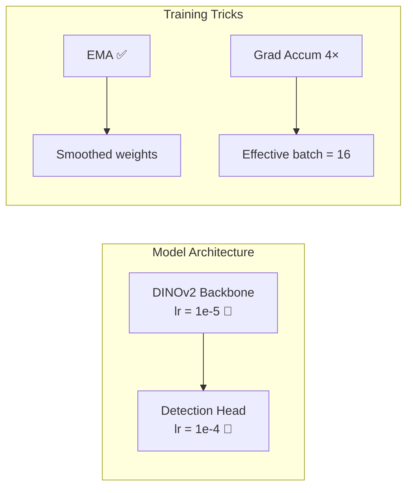

# RF-DETR-Seg Trainer

The `RFDETRTrainer` wraps Roboflow's **RF-DETR Segmentation** model — a transformer-based architecture powered by a **DINOv2 backbone** — into the modular `BaseTrainer` interface.

:material-file-code: **Source**: `src/training/trainers/rfdetr.py`
:material-tag: **Registry Name**: `"rfdetr"`

---

## What Is RF-DETR?

RF-DETR (Roboflow Detection Transformer) is a real-time, end-to-end object detection and instance segmentation model. Unlike YOLO's grid-based approach, RF-DETR uses:

- **DINOv2** as its backbone — a self-supervised Vision Transformer pretrained on massive data
- **Deformable attention** — allowing the model to attend to relevant image regions directly
- **No NMS required** — end-to-end detection with bipartite matching

| Aspect | YOLO (CNN) | RF-DETR (Transformer) |
|---|---|---|
| Backbone | CSPDarknet | DINOv2 (ViT) |
| Detection | Grid-based anchors | Learnable queries |
| Context | Local (convolutional) | Global (self-attention) |
| Post-processing | NMS | Bipartite matching |
| Min VRAM | ~4 GB | ~8 GB |
| Batch size | 16+ | 4 (with grad accum) |

---

## Registration

```python
@TRAINERS.register('rfdetr')
class RFDETRTrainer(BaseTrainer):
```

---

## Constructor

```python
def __init__(self, config: dict):
    super().__init__(config)
    self.model_size = config.get('model_size', 'm')
    self.dataset_path = Path(config.get('dataset_path'))
    self.history = []                                           # (1)!
```

1. Accumulates per-epoch loss data for plotting training curves after training completes

---

## Model Building

```python
def build_model(self):
    if self.model_size == 'm':
        self.model = RFDETRSegMedium()                          # (1)!
    else:
        self.model = RFDETRSegSmall()
```

1. Unlike YOLO where `.pt` files are loaded, RF-DETR initialises with pretrained DINOv2 weights automatically

| Size | Model Class | Backbone | Use Case |
|---|---|---|---|
| `m` (Medium) | `RFDETRSegMedium` | DINOv2-B/14 | Best accuracy |
| `s` (Small) | `RFDETRSegSmall` | DINOv2-S/14 | Faster, less VRAM |

---

## Training — Dual Learning Rates

This is the most important concept for transformer training. The DINOv2 backbone was pretrained on millions of images — you don't want to destroy those learned features with a high learning rate. So RF-DETR uses **two separate learning rates**:

```python
self.model.train(
    dataset_dir=str(self.dataset_path),
    output_dir=str(self.output_dir),
    epochs=epochs,
    batch_size=batch_size,
    resolution=resolution,

    lr=optim_cfg.get('lr', 1e-4),              # (1)!
    lr_encoder=optim_cfg.get('lr_encoder', 1e-5),  # (2)!
    weight_decay=optim_cfg.get('weight_decay', 1e-4),

    use_ema=tricks.get('use_ema', True),        # (3)!
    grad_accum_steps=tricks.get('grad_accum_steps', 4),  # (4)!

    early_stopping=es_cfg.get('enabled', True),
    early_stopping_patience=es_cfg.get('patience', 7),

    log_every_n_steps=1
)
```

1. **Head LR (1e-4)**: Higher learning rate for the detection head — this is the part that learns your specific classes
2. **Encoder LR (1e-5)**: 10× lower for the DINOv2 backbone — fine-tunes gently without destroying pretrained features
3. **Exponential Moving Average (EMA)**: Maintains a smoothed copy of the model weights, reducing oscillation
4. **Gradient accumulation**: With batch=4 and accum=4, effective batch size = 16. This is critical for transformers needing larger batch sizes but limited by VRAM



!!! warning "Why the Low Encoder LR Matters"
    Setting `lr_encoder` too high (e.g., same as `lr`) will cause **catastrophic forgetting** — the backbone loses its general visual understanding and overfits to your small dataset. The 10× gap is a well-established practice in transfer learning.

---

## Metrics Logging & Hook Bridging

RF-DETR doesn't have Ultralytics-style callbacks, so the trainer implements `_inject_framework_hooks()` to bridge RF-DETR's native `on_fit_epoch_end` event into the BaseTrainer hook system:

```python
def _inject_framework_hooks(self):
    def log_metrics_callback(data):
        self.history.append(data)                               # (1)!
        self.current_epoch = int(data.get('epoch', self.current_epoch))
        self.current_loss = float(data.get('train/loss', 0.0))
        self.loss_components = {                                # (2)!
            k: float(v) for k, v in data.items()
            if isinstance(v, (int, float)) and 'loss' in k.lower()
        }
        self.call_hooks('after_epoch')                         # (3)!
        self._flush_memory()                                   # (4)!

    if not hasattr(self.model, 'callbacks'):
        self.model.callbacks = {"on_fit_epoch_end": []}
    self.model.callbacks["on_fit_epoch_end"].append(log_metrics_callback)
```

1. Accumulates the full metrics dict each epoch — used for `_plot_metrics()` and `evaluate()`
2. Any key containing `"loss"` in the metrics dict is surfaced to hooks (e.g. `train/loss`, `train/loss_ce`, `train/loss_bbox`)
3. Broadcasts to `IndustrialLogger` and any other hooks with the current epoch state
4. Flushes GPU VRAM cache after each epoch — critical for long training runs on 12 GB VRAM

After training completes, all metrics are plotted across 6 panels:

```python
def _plot_metrics(self):
    # Panels: Loss, Detection mAP, Segmentation mAP,
    #         Precision/Recall/F1, Per-Class AP, Learning Rate
    ...
    plot_path = self.output_dir / 'metrics_plot.png'
    plt.savefig(plot_path)
```

!!! tip
    The metrics PNG is saved to `models/rfdetr/<timestamp>/metrics_plot.png` alongside the model weights. It shows train/val loss, mAP@50, mAP@50-95, segmentation mAP, per-class AP, and learning rate across all epochs.

---

## ONNX Export

RF-DETR only supports ONNX export natively:

```python
def export(self, format: str = 'onnx'):
    if format.lower() != 'onnx':
        logger.warning(f"⚠️ RF-DETR only supports ONNX. Ignoring: {format}")

    self.model.export(
        output_dir=str(self.output_dir),
        simplify=True                                       # (1)!
    )
```

1. Graph simplification removes redundant operations, making the ONNX model faster for edge deployment

The output file is named `inference_model.onnx` by Roboflow's convention.

---

## Dataset Format — COCO

RF-DETR expects COCO-format annotations (unlike YOLO's text-based labels):

```text
data/rfdetr_dataset/
├── train/
│   ├── images/
│   │   ├── img001.jpg
│   │   └── ...
│   └── _annotations.coco.json     ← COCO format
├── valid/
│   ├── images/
│   └── _annotations.coco.json
└── test/
    ├── images/
    └── _annotations.coco.json
```

The COCO JSON contains bounding boxes, segmentation polygons, category IDs, and image metadata in a single structured file.

---

## Configuration Reference

```yaml title="configs/optimizers/rfdetr_optim.yaml"
epochs: 101
batch_size: 4                          # Protect 12GB VRAM
image_size: 640                        # Must be divisible by 56 for DINOv2

optimizer:
  type: "AdamW"
  lr: 0.0001                          # 1e-4 for the head
  lr_encoder: 0.00001                 # 1e-5 for DINOv2 backbone
  weight_decay: 0.0001

training_tricks:
  use_ema: true                        # Smoothed weights
  grad_accum_steps: 4                  # 4 batch × 4 accum = 16 effective

early_stopping:
  enabled: true
  patience: 7
```

!!! info "Image Size Constraint"
    RF-DETR's DINOv2 backbone uses 14×14 patches. The image resolution must be **divisible by 56** (14 × 4 from the multi-scale feature map). 560 and 640 are the most common choices.

---

## YOLO vs RF-DETR — When to Use Which

| Scenario | Recommended |
|---|---|
| Speed matters (real-time conveyor) | :zap: **YOLO** |
| You have lots of training data (5k+) | :zap: **YOLO** |
| Objects overlap heavily | :robot: **RF-DETR** |
| Small dataset (<1k images) | :robot: **RF-DETR** (DINOv2 transfers well) |
| Maximum accuracy needed | :robot: **RF-DETR** |
| Limited VRAM (<8 GB) | :zap: **YOLO** |

---

## API Reference

::: src.training.trainers.rfdetr.RFDETRTrainer
