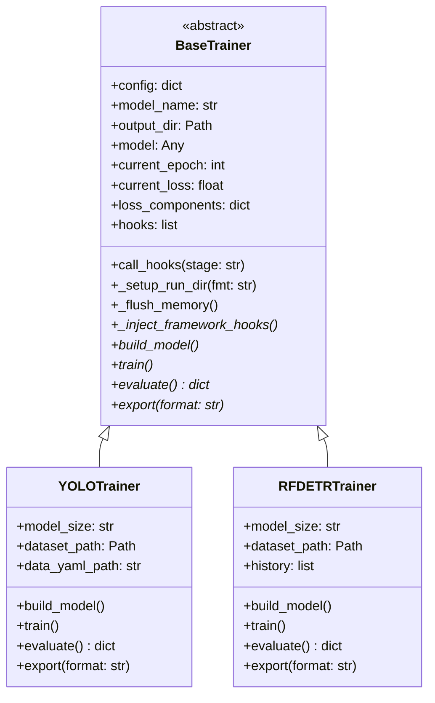

# The BaseTrainer Contract

`BaseTrainer` is the abstract foundation that **every** training engine in IsiDetector must inherit from. It defines the universal interface, manages output directories, and drives the hook lifecycle.

---

## Why an Abstract Base?

The `BaseTrainer` solves a critical problem: **the orchestration layer (`run_train.py`) needs to call `.train()`, `.evaluate()`, and `.export()` without knowing or caring which model is underneath**.



---

## Annotated Source

:material-file-code: **Source**: `isidet/src/training/base_trainer.py`

### Constructor

```python
class BaseTrainer(ABC):
    def __init__(self, config: dict):
        self.config = config
        self.model_name = config.get('model_type', 'unknown_model')  # (1)!

        # 1. Universal State Variables
        self.model = None          # (2)!
        self.current_epoch = 0
        self.current_loss = 0.0
        self.loss_components: dict = {}  # (3)!

        # 2. Common sub-config views (populated by _parse_common_config)
        self.optim_cfg = {}
        self.es_cfg = {}
        self.ckpt_cfg = {}
        self.tricks_cfg = {}

        # 3. Initialize Hooks from config
        self.hooks = []
        hook_names = config.get('hooks', [])  # (4)!
        for h_name in hook_names:
            try:
                hook_class = HOOKS.get(h_name)
                self.hooks.append(hook_class())
            except KeyError:
                logger.error(f"❌ Hook '{h_name}' not found in Registry.")
```

1. Reads `model_type` from config to use as a folder name (e.g., `"yolo"` or `"rfdetr"`)
2. These state variables are **updated by concrete trainers** during training. Hooks read them to display metrics
3. Per-epoch loss breakdown (e.g. `{'box': 0.42, 'seg': 0.31, 'cls': 0.18, 'dfl': 0.09}`). Written by trainers, read by `IndustrialLogger`
4. Reads the `hooks:` list from YAML, looks each one up in the `HOOKS` registry, and instantiates it

---

### Hook Lifecycle

```python
def call_hooks(self, stage: str):
    """
    Broadcasts the current stage to all registered hooks.
    Stages: 'before_train', 'before_epoch', 'after_epoch', 'after_train'
    """
    for hook in self.hooks:
        if hasattr(hook, stage):           # (1)!
            try:
                getattr(hook, stage)(self) # (2)!
            except Exception as e:
                logger.error(f"❌ Hook '{type(hook).__name__}.{stage}' raised: {e}")  # (3)!
```

1. Checks if the hook implements this particular stage. Hooks are free to only implement the stages they care about
2. Passes `self` (the trainer instance) to the hook, so hooks can read `trainer.current_epoch`, `trainer.current_loss`, `trainer.loss_components`, `trainer.config`, etc.
3. A failing hook is **isolated** — it never crashes training. The error is logged and training continues normally

!!! info "Broadcasting Pattern"
    This is a lightweight Observer pattern. Concrete trainers call `self.call_hooks('after_epoch')` at the right moment, and all hooks that support that stage get notified. Hook failures are caught per-hook so one bad hook cannot take down the training run.

---

### The Five Abstract Methods

```python
@abstractmethod
def build_model(self):
    """Initializes the architecture and loads it to the GPU."""
    pass

@abstractmethod
def _inject_framework_hooks(self):
    """Wire the framework's native callbacks to call self.call_hooks(stage)."""
    pass

@abstractmethod
def train(self):
    """The main training loop. MUST call self.call_hooks() at appropriate stages."""
    pass

@abstractmethod
def evaluate(self) -> dict:
    """Runs validation and returns a dictionary of metrics (mAP, etc)."""
    pass

@abstractmethod
def export(self, format: str = 'onnx'):
    """Exports the trained weights to the deployment format."""
    pass
```

| Method | Must Return | Used By |
|---|---|---|
| `build_model()` | Nothing | Called internally by `train()` if `self.model` is None |
| `_inject_framework_hooks()` | Nothing | Called by `train()` to bridge framework callbacks → `call_hooks()` |
| `train()` | Nothing | Runs the full training loop with hook calls |
| `evaluate()` | `dict` of metrics | Post-training validation: mAP, speed, etc. |
| `export()` | Export file path | Converts weights to ONNX/OpenVINO for deployment |

!!! warning "Contract Rule"
    Every concrete trainer **must** call `self.call_hooks('before_train')` and `self.call_hooks('after_train')` inside its `train()` method, and must implement `_inject_framework_hooks()` to bridge the framework's native epoch events into `call_hooks('after_epoch')`.

### Shared Helpers

```python
def _setup_run_dir(self, fmt: str = "%d-%m-%Y") -> None:
    """Creates a timestamped output directory under models/<model_name>/."""
    run_date = datetime.now().strftime(fmt)
    base_project_dir = Path(self.config.get('output_dir', 'models')) / self.model_name
    self.output_dir = base_project_dir / run_date
    self.output_dir.mkdir(parents=True, exist_ok=True)

def _flush_memory(self) -> None:
    """Force Python GC + torch.cuda.empty_cache() to return VRAM to the pool."""
    import torch
    gc.collect()
    if torch.cuda.is_available():
        torch.cuda.empty_cache()
```

!!! tip "Why `_flush_memory`?"
    PyTorch keeps freed GPU tensors in an internal cache — it does **not** return them to the OS immediately. Over many epochs this cache can occupy several hundred MB that could otherwise be used for the next epoch's forward pass. Calling `empty_cache()` after every epoch returns that memory to the CUDA pool.

---

## State Variables That Hooks Read

The base trainer maintains shared state that hooks (and other consumers) can inspect:

```python
trainer.config           # The full merged config dictionary
trainer.model_name       # "yolo" or "rfdetr"
trainer.output_dir       # Path where weights and logs are saved
trainer.model            # The underlying model object
trainer.current_epoch    # Updated each epoch by the concrete trainer
trainer.current_loss     # Updated each epoch by the concrete trainer
trainer.loss_components  # {"box": 0.42, "seg": 0.31, "cls": 0.18, "dfl": 0.09}
```

This is the **communication contract** between trainers and hooks — trainers write to these fields, hooks read from them.

!!! info "`loss_components` keys"
    **YOLO**: `box`, `seg`, `cls`, `dfl` (from `trainer.loss_items`).
    **RF-DETR**: any key containing `"loss"` in the epoch metrics dict (e.g. `train/loss`, `train/loss_ce`).

---

## How Concrete Trainers Use It

=== "YOLOTrainer"

    ```python
    class YOLOTrainer(BaseTrainer):
        def train(self):
            self.build_model()
            self._setup_run_dir()          # Timestamped output dir
            self._inject_framework_hooks() # Bridge Ultralytics → BaseTrainer hooks
            self.call_hooks('before_train')
            self.model.train(...)          # Ultralytics does the heavy lifting
            self.call_hooks('after_train')
    ```

=== "RFDETRTrainer"

    ```python
    class RFDETRTrainer(BaseTrainer):
        def train(self):
            self.build_model()
            self._setup_run_dir(fmt="%d-%m-%Y_%H%M")  # Timestamped output dir
            self._inject_framework_hooks()              # Bridge RF-DETR → BaseTrainer hooks
            self.call_hooks('before_train')
            self.model.train(...)                       # Roboflow does the heavy lifting
            self.call_hooks('after_train')
            self._plot_metrics()
    ```

Both follow the same pattern: **build → setup dir → inject hooks → hook(before) → native train → hook(after)**, but their internals are completely different.

---

## API Reference

::: src.training.base_trainer.BaseTrainer
