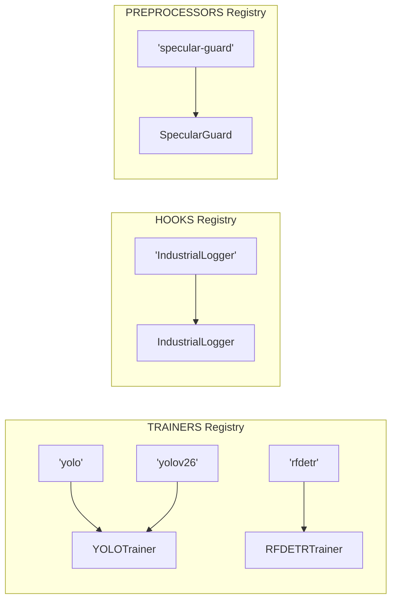

# The Registry Pattern

The `Registry` class is the backbone of IsiDetector's plug-and-play architecture. It's a **string → class lookup table** that allows the system to discover and instantiate modules purely by name, with no hardcoded imports.

---

## Why Use a Registry?

Without a registry, you'd need code like this:

```python title="❌ The Hardcoded Way"
if model_type == "yolo":
    trainer = YOLOTrainer(config)
elif model_type == "rfdetr":
    trainer = RFDETRTrainer(config)
elif model_type == "new_model":      # Every new model = edits here
    trainer = NewModelTrainer(config)
```

With a registry:

```python title="✅ The Registry Way"
TrainerClass = TRAINERS.get(model_type)  # Works for ANY registered model
trainer = TrainerClass(config)
```

!!! tip "Open/Closed Principle"
    The orchestration code is **open for extension** (new models) but **closed for modification** (no edits needed). This is a core SOLID principle.

---

## How It Works

### The Registry Class

:material-file-code: **Source**: `isidet/src/shared/registry.py`

```python
class Registry:
    """
    A simple registry to map string names to classes.
    Allows for decoupled, config-driven instantiation of modules.
    """
    def __init__(self, name: str):
        self._name = name           # (1)!
        self._module_dict = dict()  # (2)!

    def register(self, name: str = None):
        """Decorator to register a class with the registry."""
        def _register(cls):
            module_name = name if name else cls.__name__  # (3)!
            if module_name in self._module_dict:
                logger.warning(f"⚠️ Overwriting '{module_name}' in {self._name}!")
            self._module_dict[module_name] = cls          # (4)!
            return cls
        return _register

    def get(self, name: str):
        """Retrieve a class from the registry by name."""
        if name not in self._module_dict:
            available = list(self._module_dict.keys())
            raise KeyError(f"❌ '{name}' not found. Available: {available}")
        return self._module_dict[name]                    # (5)!
```

1. Human-readable name for error messages (e.g., `"Trainers"`)
2. The core storage — a plain Python dictionary mapping strings to classes
3. If no name is explicitly given, falls back to the class's own `__name__`
4. Stores the **class itself** (not an instance) — instantiation happens later
5. Returns the **class**, not an instance. The caller decides when to construct it

---

### The Three Global Registries

At the bottom of `registry.py`, three singleton instances are created:

```python
PREPROCESSORS = Registry('Preprocessors')
TRAINERS = Registry('Trainers')
HOOKS = Registry('Hooks')
```

| Registry | What it stores | Example entries |
|---|---|---|
| `TRAINERS` | Model trainer classes | `"yolo"` → `YOLOTrainer`, `"rfdetr"` → `RFDETRTrainer` |
| `HOOKS` | Training lifecycle hooks | `"IndustrialLogger"` → `IndustrialLogger` |
| `PREPROCESSORS` | Image preprocessors | `"specular-guard"` → `SpecularGuard` |

---

## Registration Mechanism

Classes register themselves using the `@register()` decorator. This happens **at import time** — as soon as Python reads the file, the class gets added to the dictionary.

### Single Registration

```python
@TRAINERS.register('rfdetr')
class RFDETRTrainer(BaseTrainer):
    ...
```

When Python imports this file, `TRAINERS._module_dict` becomes:
```python
{"rfdetr": RFDETRTrainer}
```

### Multiple Registration

A class can register under **multiple names**:

```python
@TRAINERS.register('yolov26')
@TRAINERS.register('yolo')
class YOLOTrainer(BaseTrainer):
    ...
```

Now both `TRAINERS.get('yolo')` and `TRAINERS.get('yolov26')` return `YOLOTrainer`.

!!! note "Decorator Order"
    Decorators execute **bottom-up**. So `'yolo'` registers first, then `'yolov26'`. Both point to the same class object.

---

## The Import Trigger

There's a critical detail: **decorators only run when the module is imported**. If nobody imports `yolo.py`, the `@TRAINERS.register('yolo')` decorator never fires.

`run_train.py` uses a `_TRAINER_MODULES` dict and **lazy imports via `importlib`** to trigger registration only for the model type that's actually being used:

```python title="isidet/scripts/run_train.py"
import importlib
from src.shared.registry import TRAINERS

_TRAINER_MODULES = {
    'yolo':    'src.training.trainers.yolo',
    'yolov26': 'src.training.trainers.yolo',
    'rfdetr':  'src.training.trainers.rfdetr',
}

# Only import the module for the model_type we need — triggers registration
model_type = config.get('model_type', 'yolo')
importlib.import_module(_TRAINER_MODULES[model_type])
import src.training.hooks  # Always load hooks
```

!!! warning "Common Pitfall"
    If you create a new trainer but forget to add it to `_TRAINER_MODULES` in `run_train.py`, you'll get:
    ```
    ❌ 'my_new_model' not found in Trainers registry. Available: ['yolo', 'yolov26', 'rfdetr']
    ```
    Fix: add `'my_new_model': 'src.training.trainers.my_new_model'` to `_TRAINER_MODULES`.

---

## Adding a New Module

Here's the complete checklist for adding, say, a YOLO-NAS trainer:

=== "Step 1: Create the Trainer"

    ```python title="isidet/src/training/trainers/yolo_nas.py"
    from src.training.base_trainer import BaseTrainer
    from src.shared.registry import TRAINERS

    @TRAINERS.register('yolo-nas')
    class YOLONASTrainer(BaseTrainer):
        def build_model(self): ...
        def _inject_framework_hooks(self): ...
        def train(self): ...
        def evaluate(self) -> dict: ...
        def export(self, format='onnx'): ...
    ```

=== "Step 2: Register It"

    ```python title="isidet/scripts/run_train.py"
    _TRAINER_MODULES = {
        'yolo':     'src.training.trainers.yolo',
        'yolov26':  'src.training.trainers.yolo',
        'rfdetr':   'src.training.trainers.rfdetr',
        'yolo-nas': 'src.training.trainers.yolo_nas',  # Add this line
    }
    ```

=== "Step 3: Use It"

    ```yaml title="isidet/configs/train.yaml"
    model_type: "yolo-nas"
    ```

**No other files need to change.** The registry, base trainer, hooks, and `run_train.py` pipeline all work automatically.

---

## Internal State After All Imports

After `run_train.py` runs all its imports, the registries look like this:



---

## API Reference

::: src.shared.registry.Registry
