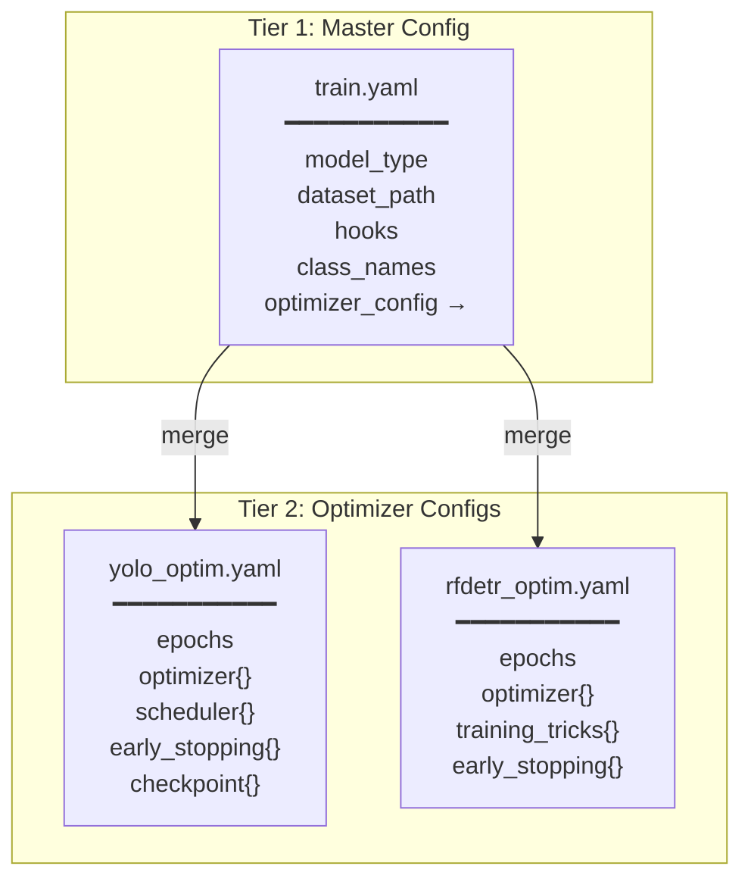

# Configuration System

IsiDetector uses a **two-tier YAML configuration** system. A master config (`train.yaml`) defines what model to use and points to a model-specific optimizer config that gets merged at runtime.

---

## Config Architecture



---

## How Merging Works

In `run_train.py`, the two configs are combined with a simple `dict.update()`:

```python title="isidet/scripts/run_train.py"
# Load master config
with open(config_path, 'r') as f:
    config = yaml.safe_load(f)

# Merge optimizer config
if 'optimizer_config' in config:
    optim_path = PROJECT_ROOT / config['optimizer_config']
    with open(optim_path, 'r') as f:
        optim_config = yaml.safe_load(f)
        config.update(optim_config)                     # (1)!
```

1. `dict.update()` merges the optimizer config **into** the main config. If both have the same key (e.g., `batch_size`), the **optimizer config wins** because it's applied second.

!!! warning "Override Order"
    Keys in the optimizer YAML will **override** keys in `train.yaml`. For example, if both files define `batch_size`, the optimizer config's value takes effect.

### Example Merged Result

=== "train.yaml"

    ```yaml
    project_name: "isiDetector"
    nc: 2
    class_names: ["carton", "polybag"]
    hooks:
      - "IndustrialLogger"
    model_type: "rfdetr"
    model_size: "m"
    optimizer_config: "isidet/configs/optimizers/rfdetr_optim.yaml"
    dataset_path: "isidet/data/rfdetr_dataset"
    batch_size: 4
    image_size: 640
    mixed_precision: true
    ```

=== "rfdetr_optim.yaml"

    ```yaml
    epochs: 101
    batch_size: 4
    image_size: 640
    optimizer:
      type: "AdamW"
      lr: 0.0001
      lr_encoder: 0.00001
      weight_decay: 0.0001
    training_tricks:
      use_ema: true
      grad_accum_steps: 4
    early_stopping:
      enabled: true
      patience: 7
    ```

=== "Merged Result"

    ```yaml
    # From train.yaml:
    project_name: "isiDetector"
    nc: 2
    class_names: ["carton", "polybag"]
    hooks: ["IndustrialLogger"]
    model_type: "rfdetr"
    model_size: "m"
    optimizer_config: "isidet/configs/optimizers/rfdetr_optim.yaml"
    dataset_path: "isidet/data/rfdetr_dataset"
    mixed_precision: true

    # From rfdetr_optim.yaml (merged):
    epochs: 101
    batch_size: 4
    image_size: 640
    optimizer:
      type: "AdamW"
      lr: 0.0001
      lr_encoder: 0.00001
      weight_decay: 0.0001
    training_tricks:
      use_ema: true
      grad_accum_steps: 4
    early_stopping:
      enabled: true
      patience: 7
    ```

---

## The Engine Switchboard

The master `train.yaml` acts as a switchboard. Only **one engine block** should be uncommented at a time:

```yaml title="isidet/configs/train.yaml"
# =========================================================
# 🛑 ACTIVE ENGINE SWITCHBOARD (Uncomment ONE block below)
# =========================================================

# ---------------------------------------------------------
# 🚀 OPTION A: YOLOv26 (CNN, NMS-free) - Fast one-to-one assignment
# ---------------------------------------------------------
# model_type: "yolo"
# model_size: "m"
# optimizer_config: "isidet/configs/optimizers/yolo_optim.yaml"
# dataset_path: "isidet/data/isi_3k_dataset"
# batch_size: 16
# image_size: 640

# ---------------------------------------------------------
# 🤖 OPTION B: RF-DETR (Transformer) - DINOv2 Backbone
# ---------------------------------------------------------
model_type: "rfdetr"
model_size: "m"
optimizer_config: "isidet/configs/optimizers/rfdetr_optim.yaml"
dataset_path: "isidet/data/rfdetr_dataset"
batch_size: 4
image_size: 640
```

---

## Complete Config Reference

### Global Keys (train.yaml)

| Key | Type | Required | Description |
|---|---|---|---|
| `project_name` | string | No | Project identifier for logging |
| `model_type` | string | **Yes** | Registry key: `"yolo"`, `"yolov26"`, or `"rfdetr"` |
| `model_size` | string | No | `"n"`, `"s"`, `"m"`, `"l"`, `"x"` |
| `optimizer_config` | string | No | Path to secondary YAML (relative to project root) |
| `dataset_path` | string | **Yes** | Path to dataset directory |
| `nc` | int | No | Number of classes (default: 2) |
| `class_names` | list | No | Class label list |
| `hooks` | list | No | Hook names to attach |
| `batch_size` | int | No | Training batch size |
| `image_size` | int | No | Input resolution |
| `mixed_precision` | bool | No | Enable AMP (default: true) |

### YOLO-Specific Keys

| Key | Type | Default | Description |
|---|---|---|---|
| `hsv_h` | float | 0.015 | Hue augmentation range |
| `hsv_s` | float | 0.7 | Saturation augmentation range |
| `hsv_v` | float | 0.4 | Value augmentation range |
| `fliplr` | float | 0.5 | Horizontal flip probability |
| `flipud` | float | 0.0 | Vertical flip probability |
| `mosaic` | float | 1.0 | Mosaic augmentation probability |
| `scale` | float | 0.5 | Scale augmentation range |
| `translate` | float | 0.1 | Translation augmentation range |
| `degrees` | float | 0.0 | Rotation augmentation range |

### Optimizer Keys

| Key | Type | Used By | Description |
|---|---|---|---|
| `optimizer.type` | string | Both | Optimizer name (e.g., `"AdamW"`) |
| `optimizer.lr` | float | Both | Base learning rate |
| `optimizer.lr_encoder` | float | RF-DETR only | Backbone learning rate |
| `optimizer.weight_decay` | float | Both | Weight decay |
| `optimizer.scheduler.type` | string | YOLO only | `"CosineAnnealing"` |
| `optimizer.scheduler.warmup_epochs` | float | YOLO only | Warmup length |
| `optimizer.scheduler.eta_min` | float | YOLO only | Minimum LR |

### Early Stopping Keys

| Key | Type | Default | Description |
|---|---|---|---|
| `early_stopping.enabled` | bool | true | Enable early stopping |
| `early_stopping.patience` | int | 10/7 | Epochs without improvement before stop |
| `early_stopping.min_delta` | float | 0.0005 | Minimum improvement threshold |
| `early_stopping.monitor` | string | `"mAP50"` | Metric to monitor |

### Training Tricks (RF-DETR only)

| Key | Type | Default | Description |
|---|---|---|---|
| `training_tricks.use_ema` | bool | true | Exponential Moving Average |
| `training_tricks.grad_accum_steps` | int | 4 | Gradient accumulation steps |

---

## CLI Arguments

```bash
python isidet/scripts/run_train.py [OPTIONS]
```

| Argument | Default | Description |
|---|---|---|
| `--config` | `isidet/configs/train.yaml` | Path to master config |
| `--resume` | `None` | Path to `last.pt` checkpoint (YOLO resume only) |

### Examples

```bash
# Default training
python isidet/scripts/run_train.py

# Custom config
python isidet/scripts/run_train.py --config isidet/configs/my_custom.yaml

# Resume from checkpoint
python isidet/scripts/run_train.py --resume isidet/models/yolo/24-03-2026/weights/last.pt
```
