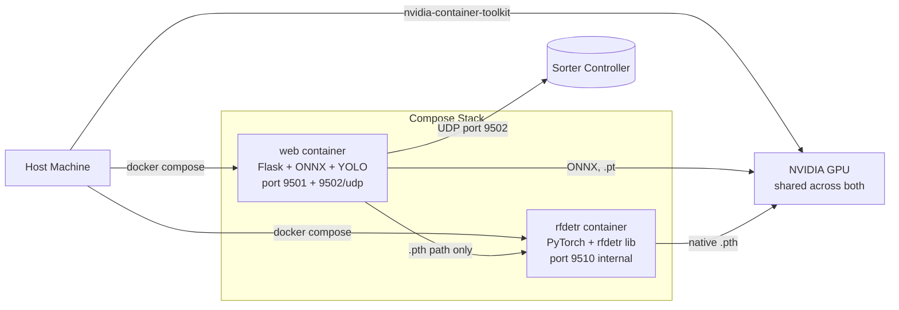

# Deployment — Docker, Scripts, and Site Bring-Up

IsiDetector ships as a Docker stack that runs identically on **CPU-only** industrial PCs (Intel i5/i7 typical) and **NVIDIA-GPU** machines (for faster real-time inference). This page walks through everything from an empty Ubuntu install to a running production line with UDP handshake to the automation engineer.

---

## Deployment Scripts — What Each Does

Five shell scripts at the repo root cover the full lifecycle. Every one of them is a 3-line thin wrapper that `exec`s the real body in `deploy/_impl/`, so the working directory and `PYTHONPATH=isidet/` are set uniformly without leaking repo-path assumptions into user invocations.

| Script | Role | Key side-effects | When to run |
|---|---|---|---|
| [`install.sh`](#complete-site-pc-setup-zero-to-production) | One-command bootstrap from a blank Ubuntu PC | `apt install git curl`, clones repo into `~/logistic`, `chmod +x` on every root wrapper, optional hand-off to `run_start.sh` | **Very first time** — before the repo even exists on the PC |
| [`run_start.sh`](#run_startsh-one-time-host-bootstrap) | Host bootstrap — auto-detect CPU vs GPU, install Docker stack, build images | Installs Docker Engine, NVIDIA Container Toolkit (GPU only), runs `docker compose build`, writes `deploy/.deployment.env` (the GPU/CPU marker up.sh reads) | **Once per machine**, after the repo is cloned |
| [`up.sh`](#upsh-daily-starter) | Daily starter | Reads `.deployment.env` → picks the `-f deploy/docker-compose.yml -f deploy/docker-compose.{cpu,gpu}.yml` chain, `up -d`, tails logs until the ONNX-preload marker, opens Chrome at `http://localhost:9501` | **Every day** / after any `docker compose down` |
| [`compress.sh`](compression.md) | Model compression & format conversion wrapper | `cd compression/` + `PYTHONPATH=isidet/` + `python -m compression "$@"`. Interactive by default; scripted via `--model … --stage/--convert …` | On the **office workstation** whenever you want to shrink a model, convert `.pt` → ONNX/OpenVINO, or benchmark variants |
| [`net.sh`](network-setup.md) | Production network lock-down + automaticien handshake | Freezes the site PC's DHCP-issued IP/gateway/DNS as static NetworkManager config; prints a bilingual (en/fr) copy-paste manual describing the UDP sort-trigger protocol for the automation engineer | **Once per site**, after `up.sh` is stable and the sorter controller is on the LAN |

All five auto-detect CPU vs GPU where relevant, so the same commands work on both hardware profiles.

!!! tip "Root wrappers keep muscle memory"
    Because the real bodies live in `deploy/_impl/`, the wrappers at root (`./up.sh`, `./compress.sh`, …) always resolve the correct working directory, compose-file paths, and `PYTHONPATH` — even if you invoke them via cron, via systemd, or from an SSH session in a different CWD. The wrappers are deliberately dumb (`exec "$(dirname "$0")/deploy/_impl/$(basename "$0")" "$@"`) so there's zero drift between the invocation surface and the real logic.

---

## Architecture at a Glance



- **`web` container** — Flask app, ONNX Runtime for `.onnx` weights, Ultralytics for `.pt` weights, sends UDP triggers to the sorter.
- **`rfdetr` sidecar** — Isolated Python environment for RF-DETR's `.pth` path (its `transformers` pin conflicts with Ultralytics, so we split). Only used when operators load a `.pth` file.
- **Shared GPU** — both containers pass through the host's NVIDIA GPU via `nvidia-container-toolkit`.

---

## Complete Site PC Setup — Zero to Production

This is the checklist to run in order on a fresh customer PC. Each step is self-contained and idempotent (safe to re-run). **Same procedure for CPU and GPU hosts** — the scripts auto-detect and branch internally; the only explicit difference is whether an NVIDIA GPU is present in the machine.

### 0. Before the PC arrives at the site

**Hardware spec per mode:**

=== "CPU-only PC"

    | Component | Minimum | Recommended |
    |---|---|---|
    | CPU | Intel i5-8xxx / AMD Ryzen 5 3xxx (4C/8T) | Intel i7-11xxx+ (AVX-512/VNNI unlocks OpenVINO fast path) |
    | RAM | 8 GB | 16 GB |
    | Disk | 40 GB free | 100 GB |
    | GPU | None | — |
    | Inference model | YOLO OpenVINO (`.xml`) — 25–50 FPS at 320 px | |
    | Network | 1 Gb Ethernet preferred; Wi-Fi OK | |

=== "GPU PC"

    | Component | Minimum | Recommended |
    |---|---|---|
    | CPU | Any x86-64 quad-core | — |
    | RAM | 16 GB | 32 GB |
    | Disk | 60 GB free | 100 GB |
    | GPU | NVIDIA with CUDA 12.8 driver (≥ 550) + 6 GB VRAM | RTX 4060+ (16 GB) |
    | Inference model | YOLO `.pt`/`.onnx`/`.engine`; RF-DETR `.pth` or `.onnx` | |
    | Network | 1 Gb Ethernet | |

**OS:** Ubuntu 22.04 LTS or 24.04 LTS (Desktop or Server). Debian derivatives should work but aren't covered by the tested install path.

### 1. Install the OS + enable SSH (once)

Plain Ubuntu install with your IT department's usual steps. Confirm the PC is on the same LAN / VLAN as the automate's PLC. Write down the LAN IP (`ip -br addr show | grep UP`) — you'll need it for step 7.

### 2. Bootstrap — one command

On the site PC, in a terminal:

```bash
sudo apt update && sudo apt install -y curl
curl -fsSL https://raw.githubusercontent.com/waledroid/IsiDetector/dev/install.sh | bash
```

`install.sh` does:

- Verifies sudo, warns if WSL2 (production should be bare-metal Linux)
- Installs `git` + `curl` if missing
- Clones the repo into `~/logistic` (dev branch)
- Makes `run_start.sh`, `up.sh`, `net.sh`, `compress.sh` executable
- Prompts to run `./run_start.sh` next — answer **y** to continue, or **n** to run manually

### 3. `run_start.sh` — build images

If you said **n** in step 2 (or curl-pipe-bash wasn't available), run the bootstrap manually:

```bash
cd ~/logistic
./run_start.sh               # auto-detect CPU vs GPU
# or force a specific mode for testing:
./run_start.sh --force-cpu   # build CPU image even on a GPU host
./run_start.sh --force-gpu   # build CUDA image even with no GPU visible
```

What happens under the hood:

=== "CPU path"

    - No `nvidia-smi` detected → `HAS_GPU=false`
    - Installs Docker Engine only (no NVIDIA Container Toolkit)
    - Builds from **`Dockerfile.cpu`** (python:3.11-slim base + CPU torch wheels + CPU onnxruntime + openvino). Image ~1.2 GB.
    - Writes `.deployment.env` with `COMPOSE_MODE=cpu`
    - Build time: 2–4 min on a decent internet connection

=== "GPU path"

    - `nvidia-smi` works → `HAS_GPU=true`
    - Installs Docker Engine **and** NVIDIA Container Toolkit
    - Runs `docker run --gpus all nvidia/cuda:... nvidia-smi` to verify GPU-in-Docker
    - Builds from **`Dockerfile`** (nvidia/cuda:12.8 base + CUDA torch + onnxruntime-gpu). Image ~5 GB.
    - Writes `.deployment.env` with `COMPOSE_MODE=gpu`
    - Build time: 5–15 min

After the build, **log out and log back in** (or run `newgrp docker`) so your user's Docker group membership takes effect without `sudo`.

### 4. Drop model weights into `isidet/models/`

The repo ships **without** trained weights (they're in `.gitignore`). Copy them from your dev machine via `scp`:

=== "CPU host — ship OpenVINO IR (fastest)"

    ```bash
    # From dev machine:
    scp -r ~/logistic/isidet/runs/segment/models/yolo/<date>/weights/openvino \
        user@site-pc:~/logistic/isidet/runs/segment/models/yolo/<date>/weights/
    ```

    ~30–60 MB total. Auto-discovered by `StreamHandler._build_engine()` which prefers `.xml` on CPU hosts.

=== "GPU host — ship ONNX or .pt"

    ```bash
    scp -r ~/logistic/isidet/runs/segment/models/yolo/<date>/weights/*.onnx \
        user@site-pc:~/logistic/isidet/runs/segment/models/yolo/<date>/weights/
    # Optional — RF-DETR .pth for native inference:
    scp ~/logistic/isidet/models/rfdetr/<date>/checkpoint_best_ema.pth \
        user@site-pc:~/logistic/isidet/models/rfdetr/<date>/
    ```

**Do not ship** `.engine` (TensorRT) files — they're compiled per specific GPU driver + device and must be regenerated on the target PC.

### 5. Start the stack — `./up.sh`

```bash
cd ~/logistic
./up.sh               # auto — reads .deployment.env
./up.sh --force-cpu   # force CPU compose override (testing)
./up.sh --force-gpu   # force GPU compose (expect failure if no GPU)
```

What it does:

- Reads `.deployment.env` for `COMPOSE_MODE`
- Sanity-check: if marker says `gpu` but `nvidia-smi` is unreachable, auto-falls back to CPU with a warning (saves you from the cryptic `could not select driver "nvidia"` error after a hardware change)
- Brings up the stack with the right compose overlay:
  - CPU: `docker-compose.yml + docker-compose.cpu.yml`
  - GPU: `docker-compose.yml + docker-compose.gpu.yml --profile gpu`
- Waits for the readiness marker (CUDA kernels warm on GPU; Flask `Running on http://` banner on CPU)
- Opens Chrome to `http://localhost:9501`

When the dashboard appears, pick your model from Settings and click **Start**. You should see detections within 2 seconds.

### 6. First-time configuration via the dashboard

On Settings:

- **Model weights** dropdowns — pick the YOLO and (optional) RF-DETR weights you just scp'd
- **Confidence threshold** — tune per scene (0.50 default, raise if polybags flicker)
- **Belt direction** + **line position** — set per physical belt
- **UDP target** — leave at `127.0.0.1:9502` for now (step 7 retargets to the automate)

Click **Save**. Settings persist in `webapp/isitec_app/settings.json` across restarts.

### 7. Point UDP at the automate + lock the network

Two edits, both persistent:

```bash
# 7a. Edit docker-compose.yml to send to the automate's IP:
cd ~/logistic
sed -i 's|UDP_HOST=127.0.0.1|UDP_HOST=<AUTOMATE_IP>|' docker-compose.yml

# 7b. Apply and commit
./up.sh                                    # container picks up new env
git add docker-compose.yml
git commit -m "Wire UDP to automate at <AUTOMATE_IP> for <site>"
git push origin dev
```

Then freeze the network config so the automate's firewall whitelist never breaks:

```bash
./net.sh show                 # see current DHCP state
sudo ./net.sh apply           # answer 'y' to freeze IP/gateway/DNS as static
./net.sh test                 # confirm all 5 reachability rows ✅
./net.sh manual               # print the French mini-manual to email the automaticien
```

See the [Production Network Lock-down](#production-network-lock-down-netsh) section below for full details on `net.sh`.

### 8. Handshake with the automation engineer

Send him the output of `./net.sh manual`. It contains:

- Our source IP (now frozen)
- The automate's IP + port (read live from the container)
- Payload JSON spec
- Three listener recipes (Python / nc / PowerShell)
- Firewall rule templates (iptables + Windows)
- A validation `test-from-abdul` handshake

Once he confirms receipt of the test string and a few live events, the bring-up is done.

### 9. Auto-start on boot (optional but recommended)

Add to crontab so the stack comes up after power loss:

```bash
(crontab -l 2>/dev/null; echo "@reboot cd $HOME/logistic && ./up.sh") | crontab -
```

Or a systemd service — see the [Daily Operations](#daily-operations) section.

### 10. Verify end-to-end

Leave the system running for ~1 hour under realistic belt traffic. Check:

- Performance dashboard (`/api/performance` page) — FPS stable, RAM flat, UDP p99 < 1 ms
- `./net.sh test` — all checks still ✅
- Automate's counter — matches your "Datagrams sent" number
- `docker compose logs web --since 1h | grep -iE 'error|warn'` — no unexpected errors

If all three look healthy, the site is in production.

---

## What to Pack for a Site Delivery

If you're shipping a tarball rather than having the customer `git clone` the public repo, the minimum folder you deliver is:

```text
isidetector-delivery/
├── install.sh                      # One-command bootstrap (clones+sets up)
├── run_start.sh                    # Host bootstrap (Docker + image build)
├── up.sh                           # Daily starter
├── net.sh                          # Network lock-down + automaticien handshake
├── compress.sh                     # Optional — INT8/FP16 ONNX compression
├── docker-compose.yml              # Base compose — device-agnostic
├── docker-compose.gpu.yml          # GPU overlay — adds nvidia device reservation
├── docker-compose.cpu.yml          # CPU overlay — swaps to Dockerfile.cpu
├── Dockerfile                      # web container — CUDA base (GPU)
├── Dockerfile.cpu                  # web container — python:3.11-slim (CPU-only)
├── Dockerfile.rfdetr               # rfdetr sidecar — CUDA base (gpu-profile-gated)
├── requirements-deploy.txt         # Shared Python deps for both images
├── .env.example                    # Template for DEV_PASSWORD + UDP overrides
├── src/                            # Shared inference + utility code
├── isitec_app/                     # Flask app (templates, static, settings.json)
├── configs/
│   └── train.yaml                  # class_names, imgsz, UDP defaults, hook list
├── models/                         # Populated at deployment — not in git
│   ├── yolo/<run_id>/weights/openvino/  # CPU preferred: .xml + .bin
│   ├── yolo/<run_id>/weights/*.onnx     # GPU / portability
│   └── rfdetr/<run_id>/*.onnx           # GPU only — OpenVINO RF-DETR is broken
├── docs/                           # MkDocs source (optional — for on-site reading)
└── scripts/                        # CLI tools (run_live.py, run_infer.py, …)
```

The **public dev branch** on GitHub already contains all of these (except `isidet/models/` which is per-deploy). `install.sh` clones the whole thing.

Exclude these (runtime artefacts, caches, training data):

```text
data/                    # Training datasets (huge)
runs/                    # Training run outputs
isitec_app/logs/         # Hourly CSV analytics (fills at runtime)
isitec_app/uploads/      # Operator-uploaded videos (fills at runtime)
.deployment.env          # Per-host flag (regenerated by run_start.sh)
**/__pycache__/
*.pyc
```

Everything in `.gitignore` is a safe exclude. If you ship a `git archive --format=tar.gz HEAD`, that list is honoured automatically.

---

## Host Prerequisites

For hardware specs (CPU/GPU minimums per mode), see the matrices in [Complete Site PC Setup — step 0](#0-before-the-pc-arrives-at-the-site).

The host machine also needs:

1. **Linux** — Ubuntu 22.04 or 24.04 tested. Debian derivatives should work. macOS / Windows via Docker Desktop are unsupported for the GPU path; WSL2 works for CPU dev but **not recommended for production** (native Linux is more stable and has lower UDP tail latency).
2. **Internet access on first run** to install Docker and pull base images. After the first build, the stack runs fully offline (re-uses the layer cache).
3. **sudo privileges** for the first run — `run_start.sh` installs system packages.
4. **(GPU mode only)** NVIDIA driver ≥ 550 supporting CUDA 12.8.

No Python, no PyTorch, no CUDA libs needed on the host itself — everything lives inside containers.

---

## `run_start.sh` — One-Time Host Bootstrap

:material-file-code: **Source**: `run_start.sh`

Run once per machine. The script walks seven stages:

| Stage | What it does |
|---|---|
| **1. Platform detection** | WSL2 vs native Linux, X11 availability, GPU presence |
| **2. Docker Engine** | Installs via official apt repo if not present |
| **3. Docker service + permissions** | Starts the daemon, adds `$USER` to `docker` group |
| **4. NVIDIA Container Toolkit** | Installs and configures if GPU detected; skipped on CPU-only hosts |
| **5. Runtime verification** | Runs `docker run --gpus all nvidia/cuda:...` to confirm GPU-in-Docker works |
| **6. Build images** | `docker compose build` — pulls base images, installs Python deps, copies code. **First build: 5–15 min.** |
| **7. GUI check** | Reports whether `cv2.imshow()` will work (for `run_live.py` CLI usage) |

Final step: writes `.deployment.env` to record whether this host is GPU or CPU, and whether `sudo` is needed for Docker commands. `up.sh` reads this file.

Invocation:

```bash
chmod +x run_start.sh        # first time only (install.sh already did this)
./run_start.sh               # auto-detect
./run_start.sh --force-cpu   # build CPU image on a GPU box (testing the customer path)
./run_start.sh --force-gpu   # build CUDA image even without GPU (CI builds)
./run_start.sh --help        # full usage
```

Build times:

| Mode | First build | Subsequent (cached) |
|---|---|---|
| GPU | 5–15 min | ~30 s |
| CPU | 2–4 min | ~10 s |

Expected output on a CPU-only host:

```
▶ Stage 1/7 — Hardware & Platform Detection
[  OK]  Platform: Native Linux
[WARN]  No NVIDIA GPU detected
[INFO]  Mode: CPU inference (OpenVINO optimized)
...
▶ Stage 6/7 — Build & Launch IsiDetector
[INFO]  Using CPU compose profile
[INFO]    → Image: Dockerfile.cpu (python:3.11-slim + CPU torch + onnxruntime CPU + openvino)
[INFO]  Building Docker image (first CPU build takes 2-4 minutes, subsequent builds are cached)...
[  OK]  Docker image ready
...
[  OK]  Deployment profile saved to .deployment.env (COMPOSE_MODE=cpu)
```

If the script aborts, fix the failing stage and re-run — it's idempotent (skips stages that already completed).

!!! tip "Idempotency"
    You can re-run `run_start.sh` any time. Already-installed packages are skipped, images are rebuilt with Docker's layer cache so only changed layers run again (usually ~30s instead of 10min).

---

## `up.sh` — Daily Starter

:material-file-code: **Source**: `up.sh` at the repo root is a thin wrapper that execs `deploy/_impl/up.sh` (the real logic)

Runs every time you want to start the stack. The flow:

1. **Pick the compose profile** — reads `.deployment.env` for `COMPOSE_MODE=gpu|cpu`. Fallback: autodetect via `nvidia-smi`.
2. **Build and start containers** — `docker compose up -d --build`. Subsequent runs hit the layer cache and finish in ~5 s.
3. **Wait for readiness** — tails the `web` container log for the line:
   ```
   🔥 ONNX preload (CUDA kernels warm, session discarded): /opt/isitec/...
   ```
   This fires after the rfdetr sidecar reports healthy AND the web container warms the default RF-DETR ONNX CUDA kernels. At that point the system is ready for a first operator click.
4. **Open Chrome to `http://localhost:9501`** — preferring Chrome, falling back to system default.

Browser selection order:

| Position | Launcher | Platforms |
|---|---|---|
| 1 | `google-chrome`, `google-chrome-stable`, `chromium`, `chromium-browser` | Linux |
| 2 | `open -a "Google Chrome"` → `open` | macOS |
| 3 | `wslview` → `cmd.exe /c start chrome` → `cmd.exe /c start ""` | WSL |
| 4 | `xdg-open` | Generic Linux |

CLI flags (symmetric with `run_start.sh`):

```bash
./up.sh                 # auto — reads .deployment.env
./up.sh --force-cpu     # use CPU compose regardless of marker/GPU
./up.sh --force-gpu     # use GPU compose even if nvidia-smi fails (requires toolkit)
./up.sh --help          # usage
```

Environment overrides:

```bash
URL=http://192.168.1.50:9501 ./up.sh    # open a remote host instead of localhost
TIMEOUT_SEC=60                ./up.sh    # tighter readiness wait (default 300)
NO_BROWSER=1                  ./up.sh    # start stack, skip browser (headless / rack deploy)
FORCE_CPU=1                   ./up.sh    # same as --force-cpu (legacy)
```

**Stale-marker protection** — if `.deployment.env` says `COMPOSE_MODE=gpu` but `nvidia-smi` is unreachable (e.g. the PC was migrated from a GPU dev box to a CPU site box without rerunning `run_start.sh`), `up.sh` automatically falls back to CPU compose with a warning rather than emitting the cryptic `could not select driver "nvidia" with capabilities: [[gpu]]` daemon error.

---

## Daily Operations

```bash
# Start (after a reboot, or first time)
./up.sh

# Restart after a code or config change
docker compose down && ./up.sh

# Stop without removing containers (faster restart later)
docker compose stop
# ...later, same day:
docker compose start

# Tail logs (live)
docker compose logs -f                 # both containers
docker compose logs -f web             # web only
docker compose logs -f rfdetr          # rfdetr sidecar only
docker compose logs --tail=200 web     # last 200 lines, no follow

# Shell into a running container for debugging
docker compose exec web bash
docker compose exec rfdetr bash

# Inspect GPU usage
docker compose exec web nvidia-smi
```

Ctrl+C while tailing logs only stops the `logs` command — **containers keep running in the background**.

---

## Deployment Modes: GPU vs CPU

The repo ships a **base-plus-overlay** Compose structure so the same source tree covers both modes without editing YAML on each host:

```text
docker-compose.yml         ← base, device-agnostic, no GPU reservation
docker-compose.gpu.yml     ← overlay: adds nvidia device reservation to web service
docker-compose.cpu.yml     ← overlay: builds from Dockerfile.cpu instead of Dockerfile
```

`run_start.sh` detects the hardware and writes `COMPOSE_MODE=gpu|cpu` to `.deployment.env`. `up.sh` reads the marker and applies the right overlay:

=== "GPU host"

    ```bash
    docker compose \
      -f docker-compose.yml \
      -f docker-compose.gpu.yml \
      --profile gpu \
      up -d --build
    ```

    - `--profile gpu` activates the `rfdetr` sidecar (gated in the base file behind `profiles: ["gpu"]`)
    - Builds from `Dockerfile` (CUDA 12.8 base, ~5 GB image)
    - `web` service gets `deploy.resources.reservations.devices: nvidia`
    - Native `.pt` / `.pth`, ONNX-CUDA, TensorRT all available

=== "CPU host"

    ```bash
    docker compose \
      -f docker-compose.yml \
      -f docker-compose.cpu.yml \
      up -d --build
    ```

    - No `--profile gpu` → `rfdetr` sidecar is skipped entirely (no build, no nvidia runtime error)
    - `web.depends_on.rfdetr` is tagged `required: false` so web starts fine without the sidecar
    - Builds from `Dockerfile.cpu` (python:3.11-slim base + CPU torch wheels + CPU onnxruntime + openvino, ~1.2 GB image)
    - Recommended inference backend: **OpenVINO (`.xml`)** — fastest on Intel CPUs (1.4–2× vs ONNX-CPU), still works on AMD
    - **RF-DETR is GPU-only in practice** — the DINOv2 backbone is too slow on CPU for real-time AND the OpenVINO IR produces wrong logits on transformer models. Stick to YOLO on CPU.

Expected CPU throughput at 320 px YOLOv26-n:

| CPU | FPS |
|---|---|
| Intel i7-1165G7 (4C/8T) | 30–45 |
| Intel i7-11850H (8C/16T) | 50–70 |
| AMD Ryzen 5 5500 (6C/12T) | 25–40 (OpenVINO's Intel-specific paths don't apply) |
| Intel i5-8250U (4C/8T) | 15–25 |

---

## Timezone

Both images set `TZ=Europe/Paris` and bundle `tzdata`. Timestamps in CSV logs, UDP payloads (`"ts"` field), and the UI footer all match the host's wall clock for a rig operating in France.

For deployments outside France, change `Europe/Paris` in three places:

- `Dockerfile` (around `ENV TZ=...`)
- `Dockerfile.rfdetr` (same pattern)
- `docker-compose.yml` → `services.web.environment` and `services.rfdetr.environment`

Or externalise with `TZ=${TZ:-Europe/Paris}` in `docker-compose.yml` and set the variable per-host in a `.env` file.

---

## ONNX Preload — Why the Boot Takes 30 Seconds

When `up.sh` starts the stack, these happen in sequence:

```
t=0s     docker compose up -d
         rfdetr container starts, begins importing rfdetr+transformers (~25s)
t=25s    rfdetr healthcheck returns 200 → "healthy"
t=26s    web container starts (depends_on: condition: service_healthy)
t=28s    Flask app boots on port 9501
t=28s    Background thread kicks off preload_onnx() on the default RF-DETR ONNX
t=33s    cuDNN kernel autotuning completes — `🔥 ONNX preload (CUDA kernels warm...)` logs
t=33s    ✓ Web container ready — up.sh opens Chrome
```

The preload discards the session but keeps cuDNN's compiled kernels in the driver cache for the process lifetime — so the first **actual** hot-swap to that RF-DETR ONNX weight (when an operator clicks Start) takes ~2 s instead of 5–8 s. See [ONNX Engine — CUDA Kernel Preload](inference/onnx.md#5-cuda-kernel-preload-at-app-startup) for the deeper story on why this workaround exists (cross-thread session sharing in ONNX Runtime's CUDA EP stalls for many seconds).

---

## Volume Mounts — What Persists Across Container Restarts

`docker-compose.yml` bind-mounts these host directories into the `web` container:

| Host path | Container path | Purpose |
|---|---|---|
| `./isidet/models` | `/opt/isitec/isidet/models` | Weight files |
| `./isidet/runs` | `/opt/isitec/isidet/runs` | Training run artefacts (read-only in deployment) |
| `./isidet/configs` | `/opt/isitec/isidet/configs` | `train.yaml` + optimizer YAMLs |
| `./webapp/isitec_app/logs` | `/opt/isitec/webapp/isitec_app/logs` | Hourly analytics CSVs |
| `./webapp/isitec_app/uploads` | `/opt/isitec/webapp/isitec_app/uploads` | Operator-uploaded videos |
| `./webapp/isitec_app/settings.json` | same | Default weight paths, thresholds, line config, belt direction |
| `./mkdocs/site` | `/opt/isitec/webapp/isitec_app/static/docs` (read-only) | Built MkDocs documentation served at `/docs` |

So adding a new `.onnx` weight is as simple as dropping it into `isidet/models/yolo/<run>/weights/` on the host — no container rebuild, no restart.

`webapp/isitec_app/settings.json` holds **per-site** configuration. Set it once after first boot:

```json
{
  "yolo_weights": "isidet/models/yolo/<your-run>/weights/best.onnx",
  "rfdetr_weights": "isidet/models/rfdetr/<your-run>/inference_model.onnx",
  "yolo_imgsz": 416,
  "yolo_conf": 0.5,
  "detr_imgsz": 416,
  "detr_conf": 0.35,
  "line_orientation": "vertical",
  "line_position": 0.5,
  "belt_direction": "left_to_right"
}
```

---

## Production Network Lock-down (`net.sh`)

Once inference runs on a site PC and the UDP handshake with the automation engineer's PLC is working, **the PC's IP, gateway, and DNS must not drift**. A DHCP lease expiry, router reboot, or Wi-Fi reconnect can silently rotate the IP — and the automaticien's firewall whitelist breaks on the spot.

`net.sh` (repo root) freezes the current DHCP-issued config into a static NetworkManager profile and provides a ready-to-email manual for the automaticien. **No site-specific value is hardcoded** — the script discovers everything at runtime, so the same one command works on every customer PC.

### Commands

```bash
./net.sh                    # same as 'show' — current network + UDP publisher state
./net.sh show
./net.sh apply              # freeze discovered values as a static config (needs sudo)
./net.sh apply --force      # skip confirm prompt (for scripts / cron)
./net.sh revert             # restore DHCP (needs sudo)
./net.sh test               # reachability checks + live UDP egress probe
./net.sh manual             # French mini-manual for the automaticien
./net.sh manual --en        # English variant
./net.sh --help
```

### What `apply` writes

```
ipv4.method                     manual
ipv4.addresses                  <current IP/CIDR, discovered>
ipv4.gateway                    <default gateway, discovered>
ipv4.dns                        <active DNS, discovered>
ipv4.ignore-auto-dns            yes
ipv6.method                     link-local
connection.autoconnect          yes
connection.autoconnect-priority 100
```

No change to what the PC is doing — it's the exact config DHCP just handed out, converted to static. That's why it always works: we're freezing a known-good state, not imposing a theoretical one.

### Override flags (if discovery is wrong)

```bash
./net.sh apply --ip 192.168.2.225/24          # pin a specific address
./net.sh apply --gateway 192.168.2.1          # override discovered gateway
./net.sh apply --dns "8.8.8.8 1.1.1.1"        # override DNS servers
./net.sh apply --conn "my-connection-name"    # operate on a non-active profile
```

### Cross-site deployment

Bringing the repo to a new customer PC with a different Wi-Fi / subnet / automate IP needs **zero file edits**:

```bash
git pull origin dev
./net.sh show         # confirm discovery found sensible values
sudo ./net.sh apply   # freeze them in place
./net.sh manual       # print the French handshake doc with this site's IPs
```

If discovery can't find a sensible value on some machine (no NetworkManager connection, IP in the Docker bridge range, no default gateway), the script errors cleanly with a "pass `--X` explicitly" hint instead of writing a bad config.

### Automaticien handshake

The mini-manual from `./net.sh manual` contains:

- Our source IP (frozen by `apply`)
- The automate's IP + port (read live from the running container's `UDP_HOST`/`UDP_PORT`)
- Payload format spec (same JSON the `UDPPublisher` emits)
- Three listener recipes: Python / netcat / PowerShell
- iptables and Windows-Firewall allowlist templates
- A one-packet validation handshake (`test-from-abdul`) — proves path end-to-end

Run it, paste the output into email or a ticket, and you have a self-contained doc that the other side can action without needing access to this repo.

### Example operator workflow on a new site

```bash
# Fresh PC with Ubuntu Desktop + NM, just reached the stage where ./up.sh
# is running and inference streams properly:

./net.sh show                   # see 'IPv4 method: auto' (DHCP)
sudo ./net.sh apply             # answer 'y' to the diff — config now locked
./net.sh test                   # all 5 rows ✅
./net.sh manual | xclip -selection clipboard
                                # paste into email to the automation engineer
```

After `apply`, a `reboot` or `sudo nmcli connection down <CONN> && up <CONN>` leaves the IP / gateway / DNS identical — the whole point of the lock-down.

### When to `revert`

- Moving the PC to a different network where DHCP is mandatory
- Troubleshooting a gateway/DNS change where you want DHCP to auto-pick new values
- Decommissioning the PC

```bash
sudo ./net.sh revert
```

The script re-enables DHCP and clears the static fields atomically.

---

## Troubleshooting

### `docker compose up` hangs for 30+ seconds at startup
Normal on first boot — the `web` service waits for the `rfdetr` sidecar's healthcheck (`depends_on: condition: service_healthy`). The rfdetr Python deps take ~25 s to import the first time. Subsequent boots on the same host are faster because layers are cached.

### UI opens but the video feed is blank
Check `/api/stats` — if `is_running: false`, no stream has been started. Go to Live Inference, pick a source (file or RTSP), click Start.

If `is_running: true` but video is still black, tail the web log:
```bash
docker compose logs -f web | grep -iE "error|fail|onnx"
```
Most common cause: the selected weight file doesn't exist. `settings.json` may point to a run that was never copied over.

### GPU not visible inside Docker
```bash
docker run --rm --gpus all nvidia/cuda:12.8.0-base-ubuntu22.04 nvidia-smi
```
If this fails, `nvidia-container-toolkit` isn't properly configured. Re-run `./run_start.sh` or manually:
```bash
sudo apt install nvidia-container-toolkit
sudo nvidia-ctk runtime configure --runtime=docker
sudo systemctl restart docker
```

### Stale image after a code change
```bash
docker compose down && ./up.sh
```
The `--build` flag in `up.sh` rebuilds only changed layers. If you want to force a full rebuild:
```bash
docker compose build --no-cache && ./up.sh
```

### VRAM creeping up over many hot-swaps
The web container holds cuDNN kernel caches and the current model's GPU allocation. A few swaps of a ~500 MB model can accumulate up to 2–3 GB. If you hit VRAM limits, `docker compose restart web` drops everything and rebuilds from the preloaded defaults in ~30 s.

### WSL2: browser opens on Windows but can't reach the service
On WSL2, `localhost:9501` is auto-forwarded by Windows most of the time. If not:
```bash
URL=http://$(hostname -I | awk '{print $1}'):9501 ./up.sh
```
This opens the browser against the WSL2 VM's internal IP directly.

---

## Summary — The One-Liner Cheat Sheet

### End-to-end bring-up on a fresh site PC

```bash
# 0. Fresh Ubuntu PC, nothing installed except curl
sudo apt update && sudo apt install -y curl

# 1. One-command install — clones the repo + bootstraps Docker + builds the image
curl -fsSL https://raw.githubusercontent.com/waledroid/IsiDetector/dev/install.sh | bash

# 2. Log out + back in so docker-group membership applies
exit      # and re-SSH / re-login

# 3. (If not done by install.sh) build the image
cd ~/logistic
./run_start.sh               # auto CPU/GPU

# 4. Drop model weights on the PC (from dev machine):
#    CPU:  scp -r <dev>:~/logistic/.../openvino  site-pc:~/logistic/.../
#    GPU:  scp <dev>:~/logistic/.../best.onnx    site-pc:~/logistic/.../

# 5. Start the stack
./up.sh

# 6. Wire the UDP target to the automate, then lock the network
sed -i 's|UDP_HOST=127.0.0.1|UDP_HOST=<AUTOMATE_IP>|' docker-compose.yml
./up.sh
sudo ./net.sh apply
./net.sh test        # expect all ✅
./net.sh manual      # pipe to email — send to the automaticien

# 7. Optional — auto-start on boot
(crontab -l 2>/dev/null; echo "@reboot cd \$HOME/logistic && ./up.sh") | crontab -
```

### Daily ops

```bash
./up.sh                       # start / resume (reads .deployment.env)
docker compose down && ./up.sh   # restart after a code/config change
docker compose logs -f web    # live logs
docker compose stop           # stop without removing containers
docker compose down           # stop + remove containers
```

### Force a specific mode (rare)

```bash
./run_start.sh --force-cpu   # build CPU image on a GPU box
./run_start.sh --force-gpu   # build CUDA image even with no GPU visible
./up.sh --force-cpu          # run CPU compose overlay
./up.sh --force-gpu          # run GPU compose overlay
```

### Network / automate handshake

```bash
./net.sh show                # current network state + UDP publisher target
./net.sh test                # reachability + live UDP egress probe
sudo ./net.sh apply          # freeze IP/gateway/DNS as static
sudo ./net.sh revert         # restore DHCP
./net.sh manual              # French mini-manual → email to automaticien
./net.sh manual --en         # English variant
```
