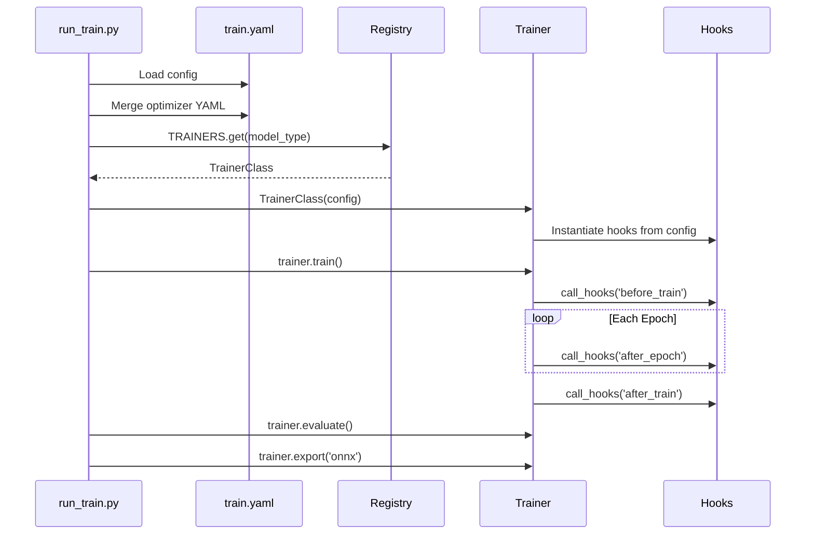

# Getting Started

This guide walks you through setting up IsiDetector and running your first training session.

---

## Prerequisites

- **Python 3.10+**
- **CUDA-capable GPU** with at least 8 GB VRAM (12 GB recommended for RF-DETR)
- **pip** for package management

---

## Installation

### 1. Clone the Repository

```bash
git clone https://github.com/waledroid/IsiDetector.git
cd IsiDetector
```

### 2. Install Dependencies

=== "For YOLO Training"

    ```bash
    pip install ultralytics supervision opencv-python pyyaml
    ```

=== "For RF-DETR Training"

    ```bash
    pip install rfdetr supervision opencv-python pyyaml pandas matplotlib
    ```

=== "For Everything"

    ```bash
    pip install ultralytics rfdetr supervision opencv-python pyyaml pandas matplotlib
    ```

---

## Dataset Setup

### YOLO Format (for YOLOv26-seg)

Your dataset should follow the standard YOLO segmentation layout:

```text
isidet/data/isi_3k_dataset/
├── images/
│   ├── train/          # Training images (.jpg)
│   ├── val/            # Validation images
│   └── test/           # Test images
└── labels/
    ├── train/          # YOLO polygon labels (.txt)
    ├── val/
    └── test/
```

!!! info "Auto-generated data.yaml"
    You don't need to create `data.yaml` yourself. The `YOLOTrainer` will **automatically generate** it from your `train.yaml` config using the `nc` and `class_names` fields.

### COCO Format (for RF-DETR)

RF-DETR expects COCO-style annotations:

```text
isidet/data/rfdetr_dataset/
├── train/
│   ├── images/         # Training images
│   └── _annotations.coco.json
├── valid/
│   ├── images/
│   └── _annotations.coco.json
└── test/
    ├── images/
    └── _annotations.coco.json
```

!!! tip "Converting Formats"
    Use `isidet/scripts/prep_rfdetr_data.py` to convert your existing YOLO-format dataset into COCO format for RF-DETR.

---

## Your First Training Run

### Step 1: Choose Your Model

Open `isidet/configs/train.yaml` and uncomment the engine block you want:

=== ":zap: YOLO (Fast, CNN-based)"

    ```yaml
    model_type: "yolo"
    model_size: "m"
    optimizer_config: "isidet/configs/optimizers/yolo_optim.yaml"
    dataset_path: "isidet/data/isi_3k_dataset"
    batch_size: 16
    image_size: 640
    ```

=== ":robot: RF-DETR (Transformer, DINOv2)"

    ```yaml
    model_type: "rfdetr"
    model_size: "m"
    optimizer_config: "isidet/configs/optimizers/rfdetr_optim.yaml"
    dataset_path: "isidet/data/rfdetr_dataset"
    batch_size: 4
    image_size: 640
    ```

### Step 2: Launch Training

```bash
python isidet/scripts/run_train.py
```

That's it. The pipeline will:

1. Load your YAML config
2. Merge the optimizer config
3. Look up the trainer from the registry
4. Run the full train → evaluate → export cycle

### Step 3: Resume Interrupted Training (YOLO only)

```bash
python isidet/scripts/run_train.py --resume isidet/models/yolo/24-03-2026/weights/last.pt
```

---

## What Happens Under the Hood



---

## Next Steps

- :material-map: Read the [Architecture Overview](architecture/overview.md) to understand the design
- :material-cog: Explore the [Configuration Guide](config/index.md) to tune every parameter
- :material-hook: Learn about the [Hook System](hooks/index.md) to add custom logging
