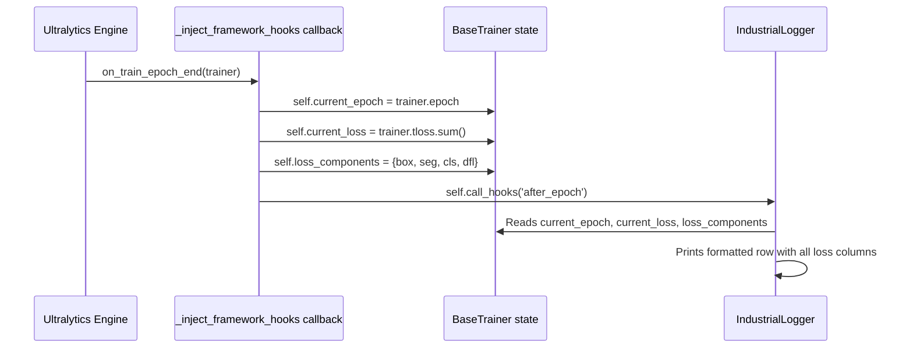

# YOLOv26-seg Trainer

The `YOLOTrainer` wraps Ultralytics' YOLOv26 segmentation engine into the modular `BaseTrainer` interface. It handles model initialisation, dataset configuration, hook bridging, and the full train/eval/export cycle.

YOLOv26 is the NMS-free variant: it uses one-to-one label assignment during training so the ONNX export at inference time emits top-K post-filtered detections directly, with no `cv2.dnn.NMSBoxes` step required downstream.

:material-file-code: **Source**: `isidet/src/training/trainers/yolo.py`
:material-tag: **Registry Names**: `"yolo"`, `"yolov26"`

---

## Registration

```python
@TRAINERS.register('yolov26')
@TRAINERS.register('yolo')
class YOLOTrainer(BaseTrainer):
```

The dual registration means you can use either `model_type: "yolo"` or `model_type: "yolov26"` in your config. Both resolve to the same class.

---

## Constructor — What Happens on Instantiation

```python
def __init__(self, config: dict):
    super().__init__(config)                                       # (1)!
    self.model_size = config.get('model_size', 'm')                # (2)!
    self.dataset_path = Path(config.get('dataset_path',
                             'data/isi_3k_dataset'))
    self.data_yaml_path = self._prepare_data_yaml()                # (3)!
```

1. Calls `BaseTrainer.__init__()` which creates output dirs, initialises state vars, and attaches hooks
2. Model size determines which pretrained weights to load (`yolo26n-seg.pt`, `yolo26m-seg.pt`, etc.)
3. Immediately checks for / generates the `data.yaml` that YOLO requires

---

## Auto-Generated data.yaml

YOLO needs a `data.yaml` file to know where images and labels live. Instead of manually creating one, the trainer **generates it dynamically** from your training config:

```python
def _prepare_data_yaml(self) -> str:
    yaml_path = self.dataset_path / 'data.yaml'

    if not yaml_path.exists():
        data_dict = {
            'path': str(self.dataset_path.absolute()),
            'train': 'images/train',
            'val': 'images/val',
            'test': 'images/test',
            'nc': self.config.get('nc', 2),                         # (1)!
            'names': self.config.get('class_names',
                     ['carton', 'polybag'])                         # (2)!
        }
        with open(yaml_path, 'w') as f:
            yaml.dump(data_dict, f, default_flow_style=False)

    return str(yaml_path)
```

1. Number of classes — reads directly from `train.yaml`
2. Class name list — also from `train.yaml`. This is the single source of truth

!!! info "Single Source of Truth"
    By generating `data.yaml` from `train.yaml`, you never have mismatched class definitions. Change `class_names` in one place and it propagates everywhere.

---

## Model Building

```python
def build_model(self):
    resume_path = self.config.get('resume_path')

    if resume_path:
        self.model = YOLO(resume_path)       # Resume from checkpoint
    else:
        model_name = f"yolo26{self.model_size}-seg.pt"
        self.model = YOLO(model_name)        # Fresh pretrained weights
```

| `model_size` | Weights File | Speed | Accuracy |
|---|---|---|---|
| `n` (nano) | `yolo26n-seg.pt` | Fastest | Good |
| `s` (small) | `yolo26s-seg.pt` | Fast | Better |
| `m` (medium) | `yolo26m-seg.pt` | Balanced | Strong |
| `l` (large) | `yolo26l-seg.pt` | Slower | Very strong |
| `x` (xlarge) | `yolo26x-seg.pt` | Slowest | Highest |

Weights are pulled automatically from Ultralytics' model hub on first use if the file is not present locally.

---

## Hook Bridging — The Key Innovation

This is the most interesting part of the trainer. Ultralytics has its **own** callback system, but IsiDetector has its **own** hook system defined in `BaseTrainer`. The trainer **bridges** between them via the required abstract method `_inject_framework_hooks()`:

```python
def _inject_framework_hooks(self):
    """Bridges Ultralytics callbacks to BaseTrainer hooks."""
    def on_train_epoch_end(trainer):
        self.current_epoch = trainer.epoch                         # (1)!

        if hasattr(trainer, 'tloss') and trainer.tloss is not None:
            self.current_loss = float(trainer.tloss.sum())         # (2)!

        if hasattr(trainer, 'loss_items') and trainer.loss_items is not None:
            items = trainer.loss_items.tolist()
            self.loss_components = {                               # (3)!
                k: float(v) for k, v in zip(['box','seg','cls','dfl'], items)
            }

        self.call_hooks('after_epoch')                             # (4)!

    self.model.add_callback("on_train_epoch_end", on_train_epoch_end)
```

1. Copy the epoch number from Ultralytics' internal `trainer` into our `BaseTrainer.current_epoch`
2. Extract the total loss from Ultralytics' PyTorch tensor — `.sum()` collapses it to a scalar
3. Populate `loss_components` with individual loss terms so `IndustrialLogger` can display each column
4. Now broadcast to **our** hooks (e.g., `IndustrialLogger`) which read `current_epoch`, `current_loss`, and `loss_components`



---

## Training Execution

The `train()` method assembles everything and launches Ultralytics:

```python
def train(self):
    if self.model is None:
        self.build_model()

    self._setup_run_dir()          # Creates models/yolo/DD-MM-YYYY/
    self._inject_framework_hooks() # Bridge Ultralytics → BaseTrainer hooks

    # Extract everything from config
    epochs = self.config.get('epochs', 300)
    batch_size = self.config.get('batch_size', 16)
    img_size = self.config.get('image_size', 640)

    # Dynamic augmentation extraction
    yolo_aug_keys = ['hsv_h', 'hsv_s', 'hsv_v', 'fliplr',
                     'flipud', 'mosaic', 'scale', 'translate', 'degrees']
    yolo_kwargs = {k: v for k, v in self.config.items()
                   if k in yolo_aug_keys}                      # (1)!

    self.call_hooks('before_train')

    # Calculate YOLO's lrf (final LR fraction)
    lr0 = optim_cfg.get('lr', 0.01)
    eta_min = sched_cfg.get('eta_min', 0.0001)
    lrf = (eta_min / lr0) if lr0 > 0 else 0.01                # (2)!

    # Timestamped run folder
    run_date = datetime.now().strftime("%d-%m-%Y")

    self.model.train(
        data=self.data_yaml_path,
        epochs=epochs,
        batch=batch_size,
        imgsz=img_size,
        project=str(base_project_dir),
        name=run_date,
        optimizer=optim_cfg.get('type', 'auto'),
        lr0=lr0,
        lrf=lrf,                                               # (3)!
        weight_decay=optim_cfg.get('weight_decay', 0.0005),
        warmup_epochs=sched_cfg.get('warmup_epochs', 3.0),
        cos_lr=(sched_cfg.get('type') == 'CosineAnnealing'),
        patience=es_cfg.get('patience', 50),
        save_period=ckpt_cfg.get('save_frequency', -1),
        **yolo_kwargs                                          # (4)!
    )

    self.call_hooks('after_train')
```

1. Scans the entire config for YOLO augmentation keys and extracts only the ones present — so you can add or remove augmentations purely in YAML
2. YOLO's `lrf` is the ratio of final LR to initial LR. We calculate it from `eta_min / lr0` so the cosine schedule ends at the right value
3. This connects your YAML scheduler config to YOLO's native cosine annealing
4. Augmentation parameters get splat-injected as keyword arguments

---

## Evaluation

The `evaluate()` method includes WSL-specific memory management:

```python
def evaluate(self) -> dict:
    self._flush_memory()  # Free VRAM before the validation memory spike

    import contextlib
    with contextlib.redirect_stdout(open(os.devnull, 'w')):  # (1)!
        results = self.model.val(
            data=self.data_yaml_path,
            batch=8,         # Lower than training batch
            workers=2,       # Prevents RAM spikes on WSL
            verbose=False
        )
```

1. `contextlib.redirect_stdout` is the safe alternative to manually swapping `sys.stdout` — it always restores the original even if `model.val()` raises an exception

After validation, it prints a formatted Executive Summary:

```text
═══════════════════════════════════════════════════════
              VALIDATION EXECUTIVE SUMMARY
═══════════════════════════════════════════════════════
 Metric              | Bounding Box   | Polygon Mask
-------------------------------------------------------
 mAP @ 50            | 0.8542         | 0.8231
 mAP @ 50-95         | 0.6128         | 0.5934
-------------------------------------------------------
 Inference Speed      | 12.45 ms per image
═══════════════════════════════════════════════════════
```

---

## Configuration Reference

=== "train.yaml"

    ```yaml
    model_type: "yolo"
    model_size: "m"
    optimizer_config: "isidet/configs/optimizers/yolo_optim.yaml"
    dataset_path: "isidet/data/isi_3k_dataset"
    batch_size: 16
    image_size: 640
    mixed_precision: true

    # Augmentations (all optional)
    hsv_h: 0.015
    hsv_s: 0.7
    hsv_v: 0.4
    fliplr: 0.5
    mosaic: 1.0
    scale: 0.5
    ```

=== "yolo_optim.yaml"

    ```yaml
    epochs: 200

    optimizer:
      type: "AdamW"
      lr: 0.001
      weight_decay: 0.0005
      scheduler:
        type: "CosineAnnealing"
        warmup_epochs: 3
        T_max: 200
        eta_min: 0.00001

    early_stopping:
      enabled: true
      patience: 10
      min_delta: 0.0005
      monitor: "mAP50"

    checkpoint:
      save_best_only: true
      save_frequency: 5
    ```

---

## API Reference

::: src.training.trainers.yolo.YOLOTrainer
