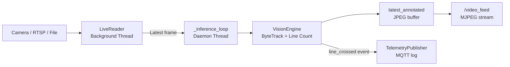

# IsiDetector VisionAI Platform

The Web Application provides a modern, responsive interface for managing your Industrial VisionAI pipeline without using the command line.

---

## System Overview

The platform is built using:
- **Backend**: Python Flask (Robust, lightweight) — or FastAPI (`webapp/isitec_api/`) as an alternative async backend with identical AI behaviour.
- **Inference Engine**: Asynchronous `StreamHandler` for non-blocking AI processing.
- **Communication**: MJPEG Streaming for low-latency visual feedback.
- **Frontend**: Clean Material Design with responsive analytics.

### Main Navigation

| Section | Purpose |
|---|---|
| **Live Inference** | Real-time visual monitoring and control. |
| **Analytics** | Historical data exploration and chart views. |
| **Models** | High-level overview of active perception weights. |
| **Settings** | Configuration of thresholds and line triggers. |

---

## Internal Architecture

The web app is split into two decoupled Python modules:

```text
isitec_app/
├── app.py              # Flask routes — thin HTTP layer only
└── stream_handler.py   # All AI and streaming logic
    ├── StreamHandler   # Session manager (start/stop, stats, language)
    ├── LiveReader      # Background video-capture thread (zero-lag queue)
    └── TelemetryPublisher  # Simulated MQTT publisher to isitec/sorting
```

**Key design principle:** `app.py` never touches OpenCV or model weights directly — it delegates everything to `StreamHandler`. This keeps Flask routes clean and thread-safe.

### Async Processing Pipeline



The `LiveReader` uses a `queue.Queue(maxsize=1)` — always discarding stale frames — so the inference thread always processes the most recent camera frame, not a backlog.

### Heartbeat

A lightweight daemon thread runs every 10 seconds to keep the process alive on platforms that may reclaim idle worker processes. It performs no I/O and has no observable side effects.

---

## Deployment
The web app is accessible internally on port **9501**.

```bash
# Flask backend
python webapp/isitec_app/app.py

# FastAPI backend (alternative, same port, same UI)
uvicorn isitec_api.app:app --host 0.0.0.0 --port 9501
```

### Docker Compose (production)

Two helper scripts wrap the whole lifecycle:

```bash
./run_start.sh       # first time on a fresh host: installs Docker, builds images
./up.sh              # daily start: launches the stack and opens Chrome when ready
```

The stack runs as **two containers**:

- **`web` container** — Flask app (`webapp/isitec_app/`), ONNX Runtime, YOLO. Port 9501 (HTTP), 9502/udp (sorter telemetry).
- **`rfdetr` sidecar** — Isolated PyTorch + `rfdetr` library for native `.pth` inference. Port 9510 (internal only, never exposed to the host).

See [**Deployment (Docker)**](../deployment.md) for the full walkthrough — site-delivery packaging, GPU vs CPU compose profiles, volume-mount semantics, timezone, ONNX preload timing, troubleshooting.

### FastAPI Backend (isitec_api)

A parallel FastAPI implementation lives in `webapp/isitec_api/` — same UI, same REST endpoints, same `StreamHandler` behaviour (including persistent hot-swap, ONNX preload, silent file-loop). It shares the core modules (`isidet/src/inference/*`, `isidet/src/shared/vision_engine.py`) with the Flask version, so any fix to those is automatically inherited.

Use the FastAPI backend when you need:

- Native async handlers (e.g. long-running WebSocket streams, `webapp/isitec_api/websockets.py`).
- ASGI deployment (`uvicorn`, `hypercorn`, `gunicorn -k uvicorn.workers.UvicornWorker`).
- Automatic OpenAPI schema + Swagger UI at `/docs`.

Otherwise the Flask backend is the default and well-tested on long-running industrial shifts.
