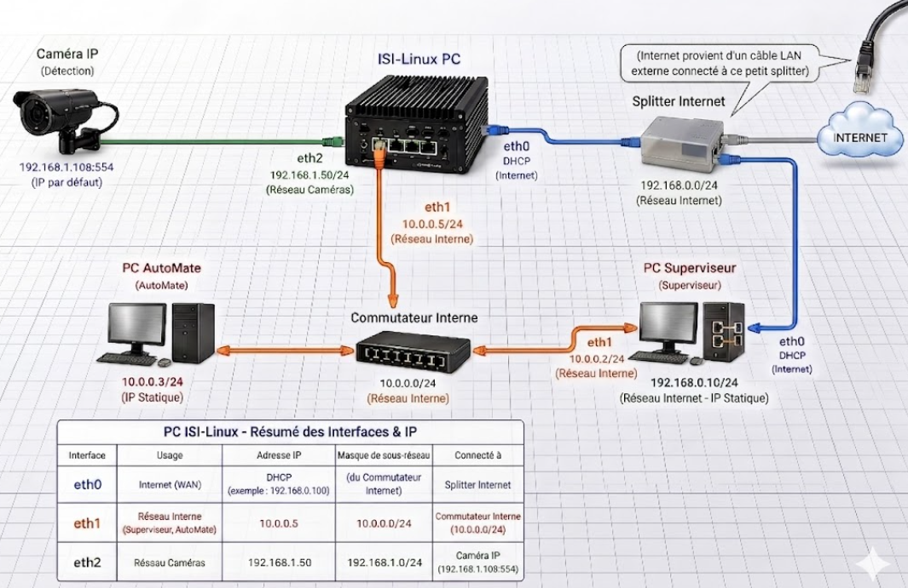

# 🛠️ Site Install — Field Engineer Runbook

Turn a fresh hardware bundle into an isi-linux PC streaming from the camera and remotely reachable. **~60 min.**

**Done when:** office team confirms remote access works.

> Repo lives at **`~/fps`** on the site PC.

---

## Network reference



| ISI-Linux NIC | IP / mask | Network |
|---|---|---|
| `enp2s0` (NIC 2) | DHCP | Réseau Internet |
| `enp1s0` (NIC 1) | 192.168.1.50/24 | Réseau Caméra (cam at 192.168.1.108) |
| `enx…` (USB-eth) | 10.0.0.5/24 | Réseau Automate (PLC at 10.0.0.10) |

⚠️ Don't plug camera or automate cables yet — Step 1 first.

---

## 1️⃣  Splitter

Splitter on the wall cable → one leg to **PC Superviseur**, other to **ISI-Linux** (don't connect yet). Power on both PCs.

📸 **Photo 1** — splitter + both legs.

---

## 2️⃣  ISI-Linux NICs (one at a time, in this order)

Unplug every ethernet cable from the ISI-Linux PC first.

```bash
cd ~/fps && git pull origin fps
```

### 2a — Internet (DHCP)

Plug only the internet cable into `enp2s0`. Run:

```bash
sudo ./net.sh setup
```

For `enp2s0`: **`dhcp`**, gateway/DNS blank.

```bash
ping -c 3 1.1.1.1   # must be 3/3
```

### 2b — Camera (static)

Plug the camera cable into `enp1s0`. Run `sudo ./net.sh setup` again.

For `enp1s0`: **`static`**, IP `192.168.1.50`, mask `24`, gateway/DNS blank.

### 2c — Automate (USB-Ethernet, static)

Plug the USB-Ethernet adapter; plug the short cable from it into the internal switch. Run `sudo ./net.sh setup` again.

For the new `enx…` interface: **`static`**, IP `10.0.0.5`, mask `24`, gateway/DNS blank.

```bash
ip -4 addr show     # all three NICs with their IPs
```

📸 **Photo 2** — back of PC, three cables labelled.
📸 **Photo 3** — terminal `ip -4 addr show`.

---

## 3️⃣  Camera

Mount + power the camera. Wait 30 s. Test:

```bash
ping -c 3 192.168.1.108
./cam_status.sh
```

Look for `📹 Stream: WxH @ N fps codec=h264`.

📸 **Photo 4** — camera mounted on the belt.
📸 **Photo 5** — `cam_status.sh` output.

---

## 4️⃣  Remote access (Tailscale + RustDesk)

Follow [`remote-setup.md`](remote-setup.md). For Tailscale auth, sign in with the **`isivision`** Gmail account.

After it completes (reboot if prompted):

```bash
./remote.sh status
```

Must show: `session: x11`, `Tailscale: connected` + 100.x.x.x IP, `RustDesk: running` + 9-digit ID, password `Isitec69+`.

📸 **Photo 6** — full `./remote.sh status` output.

---

## 5️⃣  Handoff

Send all 6 photos to office (WhatsApp + email). They'll connect via `100.x.x.x:21118` in RustDesk and validate the inference stream. Wait for "we're in, you can leave" — then pack up.

---

## 🆘 Troubleshooting

| Symptom | Fix |
|---|---|
| No DHCP on `enp2s0` | Re-plug splitter; test wall jack with RJ45 tester |
| `ping 192.168.1.108` fails | Camera unpowered or wrong cable; try `sudo nmcli con up "Cam"` |
| `cam_status.sh` no stream | Camera web GUI → System → RTSP enabled, port 554 |
| Tailscale auth times out | Device awaiting approval — office clicks Approve at admin.tailscale.com/admin/machines |
| `session: wayland` after setup | Reboot once |
| `apt purge` fails | `sudo dpkg --configure -a && sudo apt-get -f install`, retry |
| Camera FPS < 20 | Office can switch RTSP URL to sub-stream remotely |

Anything else: photo the screen + call office.

---

## Don't

- Don't hand-edit `/etc/netplan/*.yaml` (net.sh writes the right NetworkManager profiles).
- Don't `ip addr add` (won't survive reboot).
- Don't skip the photos.
